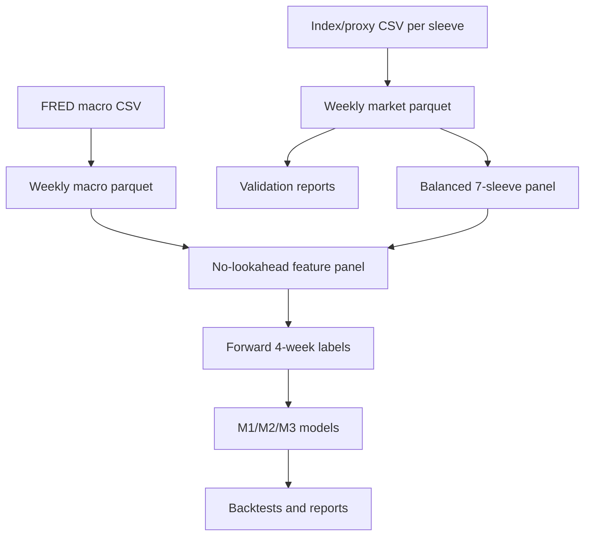

# Data Sources and ETL Review Notes

This note is for reviewers auditing data provenance, ETL, and no-lookahead controls behind the multi-asset meta-labeling pipeline.

**Policy:** Research **signals** are computed on **index sleeves** (benchmark price series). Public download may use ETF trackers or futures as **proxies** where a free true index is unavailable. Sleeve IDs in the panel are asset-class identifiers, not trade tickets.

See also: [TERMINOLOGY.md](TERMINOLOGY.md) · [config/config.yaml](config/config.yaml) `assets.index_sources`

---

## Index Universe (7 sleeves + VIX)

| Sleeve ID | Asset class | Fetch provider | Fetch symbol | Notes |
| --- | --- | --- | --- | --- |
| `SP500` | U.S. equity | Yahoo | `^GSPC` | S&P 500 index |
| `MSCI_EAFE` | Dev. ex-U.S. equity | Yahoo | `EFA` | ETF proxy (free EAFE index history limited) |
| `MSCI_EM` | Emerging markets | Yahoo | `EEM` | ETF proxy |
| `UST_7_10` | Govt bonds 7–10Y | Yahoo | `IEF` | ETF proxy |
| `US_HIGH_YIELD` | High yield credit | Yahoo | `HYG` | ETF proxy |
| `GOLD_SPOT` | Gold | Yahoo | `GC=F` | Futures / spot proxy |
| `US_REIT` | U.S. real estate | FRED | `NASDAQNQUSB351020` | Nasdaq US Benchmark REIT index |
| `VIX` | Risk feature only | Yahoo | `^VIX` | Not traded |

**Legacy mapping (pre-migration docs):** SPY→SP500, VEA→MSCI_EAFE, VWO→MSCI_EM, TLT→UST_7_10, HYG→US_HIGH_YIELD, GLD→GOLD_SPOT, VNQ→US_REIT.

**Binding constraint:** Full 7-sleeve balanced panel starts ~**2011** when `US_REIT` FRED history is available (not 2007 ETF launch dates).

Implementation: [`src/data_providers.py`](src/data_providers.py) — `IndexProvider` caches to `data/raw/index/<sleeve_id>.csv`.

---

## Macro Data (features only)

| Series | Source | Use |
| --- | --- | --- |
| `CPIAUCSL`, `UNRATE`, `INDPRO`, `FEDFUNDS` | FRED | Regime / macro features |
| `DGS10`, `T10Y2Y`, `BAA10Y` | FRED | Rates, curve, credit stress |

Macro series are **not traded**. Forward-filled to weekly frequency and lagged by `features.macro_lag_weeks` (4 weeks).

---

## ETL Flow



### 1. Ingest

- Market: `IndexProvider` downloads Yahoo/FRED per `assets.index_sources`, stores sleeve ID in `ticker` column.
- Macro: `FredProvider` → `data/raw/macro_daily.parquet`, weekly `data/processed/macro_weekly.parquet`.
- Weekly market: `data/processed/market_weekly.parquet`.

### 2. Resampling

Market data resampled to `W-FRI` (Friday): OHLCV aggregates; `adj_close` = last daily adjusted close in the week.

### 3. Cache and refresh

Cached parquet used by default. `--refresh-data` rebuilds from `data/raw/index/`. Auto-refresh if `data_start` predates cached history.

Macro partial FRED failure: preserve cache or market-derived proxy (logged as research fallback).

### 4. Panel construction

```yaml
split.require_full_universe: true   # default — all 7 sleeves each week
```

Partial universe: `python -m src.run_pipeline --partial-universe`

### 5. Validation

Per run under `runs/<timestamp>/`: `validation_report.json`, `ticker_coverage.csv`, `model_panel_validation.json`.

### 6. Feature engineering

`src/feature_engineering.py` — momentum/trend/vol shifted +1 week; macro lagged 4 weeks; train-only winsorization; labels excluded from M1/M2 features.

---

## Reviewer caveats

1. **Vendor quality** — Yahoo/FRED are research-grade, not institutional point-in-time.
2. **Proxy sleeves** — EAFE/EM/HY/UST use ETF trackers where free index history is short.
3. **Macro lag** — 4-week lag is conservative, not release-calendar exact.
4. **Proxy macro fallback** — logged when FRED partial fails.
5. **Balanced start ~2011** — `US_REIT` index history binding constraint.
6. **Transaction costs** — default 5 bps; no borrow/impact/tax.
7. **Walk-forward** — enabled in config; see `reports/walk_forward_analysis.md`.

---

## Current data state (after index refresh)

- Effective balanced panel: ~**2011-06** through latest weekly bar
- Sleeve IDs in panel: `SP500`, `MSCI_EAFE`, `MSCI_EM`, `UST_7_10`, `US_HIGH_YIELD`, `GOLD_SPOT`, `US_REIT`, `VIX`

---

## Files to inspect

| Area | File |
| --- | --- |
| Index provider | `src/data_providers.py` |
| Validation | `src/data_validation.py` |
| Features | `src/feature_engineering.py` |
| Pipeline | `src/run_pipeline.py` |
| Final report | `reports/final_report.md` |
| Asset catalog | `reports/assets/asset_component_analysis.md` |
