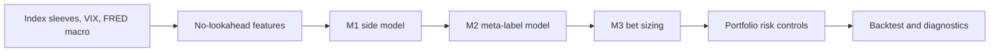

# Project Summary — Multi-Asset Meta-Labeling Pipeline

This branch contains a research-grade Python pipeline for a weekly, seven-sleeve multi-asset allocation strategy. It follows the **Joubert (2022) three-layer** meta-labeling design:

1. **M1** decides the trade side: long, short, or flat.
2. **M2** estimates the probability that an M1 trade will be profitable (`p_success`).
3. **M3** converts M2 probability into a bet fraction (`M3_size` ∈ [0, 1]) — a deterministic sizing rule, not a classifier.
4. **Portfolio** applies exposure caps and volatility targeting to produce final weights.

The project is for **research and education only**. It is not live trading infrastructure or investment advice.

**Branch update vs `main`:** [BRANCH_UPDATE_REPORT.md](BRANCH_UPDATE_REPORT.md) (executive) · [reports/branch_update_vitaly_week5.md](reports/branch_update_vitaly_week5.md) (technical)

**New to finance terms?** See [TERMINOLOGY.md](TERMINOLOGY.md) — plain-language glossary for index sleeves, Sharpe, ECDF, M1/M2/M3, and all report jargon.

## Branch vs `main` (July 2026)

| Area | `main` | `vitaly_week5` |
| --- | --- | --- |
| Explainability | `final_report.md` only | +6 companion reports, Deep Diagnostics |
| M3 layer | Implicit sizing | Formal M3, `M3_size` on panel |
| M2 test AUC | ~0.573 (40 features) | **0.589** (52 enriched features) |
| ECDF test Sharpe (2021+) | 0.851 | **0.964** (+0.113) |
| M1 weight tuning | — | IC-proportional → Sharpe **0.795** vs **0.787** (research) |
| Evaluation | — | TC sensitivity; walk-forward module |
| Tests | 48 | **61** |

M1-only economics are **unchanged**; ECDF improves because richer M2 features change `p_success` and therefore ECDF bet fractions.

## Current State

The current best production-like interpretation is the **long-only** sleeve. Long/short is still run for research comparison, but shorts have generally hurt results in this index sleeve universe. The headline metrics below are **full sample (train + test)** unless explicitly labeled otherwise.

| Strategy | Ann. Return | Sharpe | Max Drawdown | Interpretation |
| --- | ---: | ---: | ---: | --- |
| Equal Weight 1/7 | 7.36% | 0.57 | -39.44% | Fully invested passive benchmark |
| **M1 Only, long-only** | **7.32%** | **0.70** | **-21.00%** | Nearly benchmark return with much lower drawdown |
| M1 + M2 + M3 (Binary) | 7.38% | 0.71 | -21.00% | Binary M3 at T=0.55 ≈ M1-only (recall ≈ 1) |
| M1 + M2 + M3 (Linear) | 1.77% | 0.84 | -5.11% | Very defensive sizing; high Sharpe but too little return |
| M1 + M2 + M3 (ECDF) | 6.54% | 0.96 | -16.26% | Best risk-adjusted variant; **+0.113 test Sharpe vs `main` ECDF (0.85)** |

Main takeaway: **M1 is close to equal-weight on return while improving Sharpe and cutting drawdown roughly in half. M3 ECDF sizing is the main risk-control layer — not M2 as a hard filter at the current threshold.**

Reviewer caveat: the equal-weight benchmark is shown with 0 bps transaction costs, while strategy variants pay the configured 5 bps turnover cost. M1's average gross exposure is about 81%, not 100%, so the result should be framed as similar return with lower deployed risk and drawdown, not as strong positive excess return.

The generated final report separates **full-sample** and **test-period** portfolio metrics. On the 2021+ long-only test window, M1-only reports 8.40% annualized return / 0.79 Sharpe versus equal-weight at 7.34% / 0.69; M1+M2+M3 ECDF reports 7.02% / **0.96** Sharpe (vs **0.85** on `main`).

## How the Pipeline Works



### Data

- Index sleeves: `SP500`, `MSCI_EAFE`, `MSCI_EM`, `UST_7_10`, `US_HIGH_YIELD`, `GOLD_SPOT`, `US_REIT`
- Risk/macro inputs: VIX and FRED series (`CPIAUCSL`, `UNRATE`, `INDPRO`, `FEDFUNDS`, `DGS10`, `T10Y2Y`, `BAA10Y`)
- Frequency: weekly Friday close
- Default full-universe effective start: around 2011 when `US_REIT` FRED index history begins
- Cache behavior: if requested `data_start` materially predates cached data, the pipeline refreshes automatically

### M1

M1 is the primary side model. It scores each index sleeve each week using:

- Momentum and relative momentum
- Trend
- Volatility and drawdown penalty
- Asset-class macro tilts
- Macro/carry-style features

Current default M1 behavior:

- `allocation_mode: top_k`
- `top_k: 3`
- `allow_short: false` in the primary long-only sleeve
- `conviction_sizing: false`
- `portfolio.vol_target_ann: 0.12`

The important practical change is that M1 no longer tries to be active on every sleeve. It selects the top-ranked names each week and applies a volatility budget. Disabling M1 conviction down-scaling improved return materially because the score already acts as a selector; further scaling was over-suppressing selected trades.

Component scores (`momentum_score`, `trend_score`, etc.) are now persisted for factor-level diagnostics — see [reports/m1_factor_analysis.md](reports/m1_factor_analysis.md).

### M2

M2 is a logistic regression meta-labeling model trained only on non-zero M1 trades. It predicts:

```text
P(M1 trade is profitable over the forward 4-week label horizon)
```

M2 output is **`p_success` only**. Threshold approval (`predicted_meta_label`) is a diagnostic M3 preview, not an M2 model output.

M2 is not currently a strong standalone classifier (test AUC-ROC ≈ **0.589**, up from **~0.573** on `main` with legacy features). Its value is better understood as **input to M3 sizing**:

- M2 provides calibrated probabilities for continuous bet sizing.
- At threshold 0.55, recall ≈ 1 — binary M3 approves nearly all candidates.

See [reports/m2_diagnostics.md](reports/m2_diagnostics.md) for calibration, decile returns, and AUC-ROC interpretation.

### M3

M3 is the **bet-sizing layer** (Joubert framework). It maps `p_success` to `M3_size` ∈ [0, 1] before portfolio constraints:

- **Binary M3** — all-or-nothing at threshold T (default 0.55)
- **Linear M3** — `max(0, 2p − 1)`; very low exposure and drawdown
- **ECDF M3** — rank-based sizing on train distribution; best risk-adjusted balance

Allocation states on the panel: `no_signal` (M1=0), `m3_zero` (candidate rejected by sizing), `m3_active` (positive bet fraction).

See [reports/m3_allocation_analysis.md](reports/m3_allocation_analysis.md). See [reports/evaluation_analysis.md](reports/evaluation_analysis.md) for transaction-cost sensitivity (ECDF edge **+0.177** Sharpe @ 5 bps, **+0.046** @ 25 bps vs M1-only on test window).

## Methods Tried and Insights

### 1. Long-only vs long/short

The pipeline always runs both modes. The consistent insight is that **long-only is superior** for this index sleeve sample. Long/short adds activity, but short timing is weak in an upward-drifting multi-asset index sleeve universe.

Current long/short M1-only return is much lower than long-only, even though drawdown can be lower. Treat long/short as a diagnostic experiment, not the main investment story.

### 2. M1 threshold model vs top-K allocator

Earlier M1 logic used absolute score thresholds. This was conservative and left too much capital in cash. The branch now defaults to a weekly top-K cross-sectional allocator:

```text
Each week, rank sleeves by M1 score and allocate to the top 3 names.
```

Insight: top-K better matches the problem. In a seven-asset sleeve, relative ranking is more useful than asking whether each score clears a fixed absolute level.

### 3. M1 conviction sizing

Conviction sizing mapped M1 score magnitude into `[0, 1]` and multiplied the base weight. This seemed reasonable, but experiments showed it suppressed return too much.

Key experiment from `runs/m1_perf_experiments_round2.csv`:

| Setting | M1 Return | M1 Sharpe | M1 Max DD |
| --- | ---: | ---: | ---: |
| Top-3 with conviction sizing | 6.05% | 0.71 | -17.92% |
| **Top-3 without conviction sizing** | **7.32%** | **0.70** | **-21.00%** |

Insight: M1 score is useful for **selection**, but not yet reliable enough for fine-grained sizing. Use M3 ECDF and portfolio volatility targeting for sizing instead.

### 4. Volatility target

The volatility target was increased from 10% to 12%. This improved M1 return without materially hurting Sharpe.

Insight: the strategy was under-deployed relative to its risk budget. A 12% target is still below/near equal-weight realized volatility but gives M1 enough room to compete on return.

### 5. M3 threshold grid

The grid search swept `m2.threshold` from 0.50 to 0.62. For M1+M2+M3 linear, this had no effect because linear sizing uses continuous probability rather than the binary threshold.

Insight: when ranking linear sizing, do not waste grid dimensions on `m2.threshold`. Use threshold sweeps for binary M3 only, or grid over sizing mode instead.

### 6. Train/test split sensitivity

The 40-run grid search found `train_end` mattered more than M2 threshold or small transaction-cost changes.

Insight: the strategy is regime-sensitive. Always quote which train/test window is being used. The default split is train through 2020, test from 2021 onward. Also note that the checked-in grid search predates the current top-K / 12% vol-target / no-conviction defaults, so it is historical sensitivity evidence rather than final tuning proof for the latest branch state.

### 7. Data refresh and cache safety

The pipeline now automatically refreshes data when requested history materially predates cached history. It also protects against partial FRED refreshes by preserving cached series or filling missing series with proxy macro data when needed.

Insight: stale or partial data can change features and backtests silently, so the pipeline now makes this behavior explicit.

## How to Interpret M1 + M2 + M3

The most useful mental model is:

```text
M1 = opportunity selector
M2 = trade quality probability
M3 = capital deployment rule
Portfolio = risk-budget enforcement
```

M1 should be judged by whether it selects a better basket than equal-weight: return, Sharpe, drawdown, and information ratio.

M3 should be judged by whether it improves the return/drawdown tradeoff of M1:

- If the goal is **maximum return**, M1-only is currently strongest.
- If the goal is **risk-adjusted return**, M1+M2+M3 ECDF is currently strongest.
- If the goal is **minimal drawdown**, M1+M2+M3 linear is strongest but too low-return for the main story.

For presentations, lead with:

> M1 selects ~3 sleeves per week. M2 assigns P(success) with ~59% base rate. M3 ECDF lowers volatility and drawdown at the cost of some return. Binary M3 at T=0.55 approves almost all trades — so it looks like M1-only by design.

## Important Files

| Area | Path |
| --- | --- |
| Main config | `config/config.yaml` |
| Pipeline entrypoint | `src/run_pipeline.py` |
| M1 model | `src/model_m1.py` |
| M2 model | `src/model_m2.py` |
| M3 bet sizing | `src/model_m3.py` |
| Sizing/backtest | `src/portfolio.py`, `src/backtest.py` |
| Diagnostics/reporting | `src/diagnostics.py`, `reports/final_report.md` |
| Branch briefing | `ARCHITECTURE_BRIEFING.md` |
| Branch update report | `BRANCH_UPDATE_REPORT.md` |
| Experiment CSVs | `runs/m1_perf_experiments.csv`, `runs/m1_perf_experiments_round2.csv` |

## Current Limitations

- Data are research-grade (`yfinance`, FRED), not point-in-time institutional feeds.
- Data provenance and ETL details are documented in `DATA_SOURCES_AND_ETL.md`; reviewers should start there for source, cache, validation, and proxy-fallback behavior.
- M2 AUC is modest (~**0.59**); it is useful for M3 sizing input, not a strong classifier yet.
- Binary M3 at T=0.55 adds little filtering (recall ≈ 1).
- Long/short mode underperforms; short-side signal quality needs separate work.
- Results are historical simulations and do not include capacity, market impact, borrow, tax, or live execution constraints.
- Some improvements are based on full-sample diagnostics; walk-forward module is available (`evaluation.walk_forward_enabled`) but requires a full pipeline run (~20 min).

## Suggested Next Work

1. **Apply IC-proportional M1 weights** after walk-forward confirmation (+0.008 test Sharpe in research).
2. **Run full walk-forward** with `evaluation.walk_forward_enabled: true`.
3. **M3 threshold sweep** — T=0.55 approves ~99% of trades (recall ≈ 1).
4. **Regime-conditioned M3** — ECDF Sharpe 1.21 in risk-off vs 0.86 in risk-on (full sample).
5. Improve short-side logic separately (long/short test Sharpe 0.47 vs long-only 0.79).
6. Replace research data with institutional point-in-time data before external claims.

**Ruled out (tested on branch):** per-asset M2 heads and tree models (test AUC ~0.48–0.50, overfit).

See [reports/branch_update_vitaly_week5.md](reports/branch_update_vitaly_week5.md) for the full prioritized roadmap.
