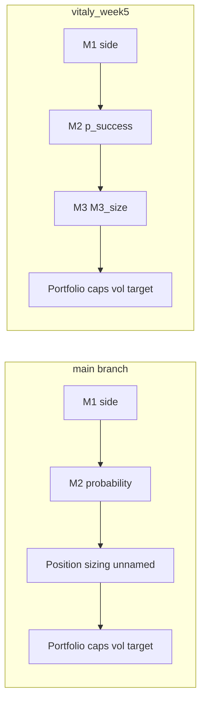

# Branch Update — Technical Report (`vitaly_week5` vs `main`)

**Research use only — not investment advice.**

**Executive summary for PMs:** [BRANCH_UPDATE_REPORT.md](../BRANCH_UPDATE_REPORT.md)

---

## Table of Contents

1. [Branch snapshot](#branch-snapshot)
2. [Conceptual reframing: M1 / M2 / M3](#conceptual-reframing-m1--m2--m3)
3. [Workstream 1: Deep diagnostics](#workstream-1-deep-diagnostics)
4. [Workstream 2: M3 formalization](#workstream-2-m3-formalization)
5. [Strategy naming migration](#strategy-naming-migration)
6. [Performance and findings](#performance-and-findings)
7. [File-by-file change map](#file-by-file-change-map)
8. [What did not change](#what-did-not-change)
9. [Known gaps](#known-gaps)
10. [Recommended next steps](#recommended-next-steps)

---

## Branch snapshot

| Item | Value |
| --- | --- |
| Branch | `vitaly_week5` |
| Commits ahead of `main` | 3 |
| Diff scale | ~156 files, +6,317 / −232 lines |
| Tests | 48 on `main` → **51 passing** on branch |
| Nature of change | Observability, naming, diagnostics, documentation — **not** new alpha logic |

**Commits (newest first):**

1. M3 formalization (Joubert framework) — `model_m3.py`, allocation diagnostics, strategy rename
2. M3 follow-up — test fixes, grid search keys, pipeline wiring
3. Deep diagnostics — factor analysis, regime analysis, extended M2 metrics, companion reports

Regenerated artifacts (reports, figures, `runs/` snapshots) account for much of the line count. Core Python modules added: **4 new files**; `diagnostics.py` expanded by ~738 lines.

---

## Conceptual reframing: M1 / M2 / M3

On `main`, the pipeline was described as a **two-stage** meta-labeling stack (M1 + M2) with an unnamed “position sizing” step buried inside the backtest. On `vitaly_week5`, sizing is an explicit **M3 bet-sizing layer** per Joubert (2022, *JFDS* 4(3), pp. 31–44).

| Layer | Question | Output | Logic changed? |
| --- | --- | --- | --- |
| **M1** | Which side? | `M1_signal` ∈ {-1, 0, 1} | No — **component scores now persisted** |
| **M2** | How likely is the M1 trade profitable? | `p_success` ∈ [0, 1] | No — **richer evaluation and charts** |
| **M3** | How much capital to bet? | `M3_size` ∈ [0, 1] | **Formalized** (was ephemeral `size` in backtest) |
| **Portfolio** | Risk budget enforcement | `final_weight` | No — caps, 12% vol target unchanged |

**Wording adopted across reports:**

> M2 output = probability that the M1 signal works  
> M3 output = how much to invest (bet fraction before portfolio constraints)

M3 rules (deterministic, not ML):

| Mode | Formula | Role |
| --- | --- | --- |
| `binary` | f = 1 if p > T else 0 | All-or-nothing (Joubert Eq. 9) |
| `linear` | f = max(0, 2p − 1) | Continuous down-scaling |
| `ecdf` | f = ECDF_train(p) | Rank-based sizing (Joubert Eq. 10) |
| `passthrough` | f = p | Diagnostic only |

### Allocation states (long-only)

New diagnostic vocabulary distinguishes **no candidate** from **candidate rejected by sizing**:

| State | Condition | Meaning |
| --- | --- | --- |
| `no_signal` | M1 = 0 | Asset not selected by M1 top-K |
| `m3_zero` | M1 ≠ 0, M3_size = 0 | Buy candidate existed; M3 allocated zero |
| `m3_active` | M1 ≠ 0, M3_size > 0 | Positive bet fraction before portfolio caps |

Optional fourth bucket (not yet implemented): M1=1, M3>0, but `final_weight=0` after portfolio caps.

### Architecture diagram



Weight construction:

```text
raw_weight = M1_signal × M3_size × base_budget_per_asset
final_weight = portfolio_constraints(raw_weight)   # caps + vol target
```

---

## Workstream 1: Deep diagnostics

### M1 factor analysis

**New module:** [`src/factor_analysis.py`](../src/factor_analysis.py)

**New M1 capability:** `predict_component_scores()` on `RuleBasedM1` — four component columns persisted on the panel (`momentum_score`, `trend_score`, `macro_score`, `risk_penalty`).

**Outputs:**

| Artifact | Description |
| --- | --- |
| `m1_factor_ic.csv` | Spearman IC per factor (full/train/test) |
| `m1_factor_correlation.csv` | Factor correlation matrix |
| Factor sleeve backtests | Long-only sleeves per factor family |
| Weight ablation | Composite score sensitivity to weight changes |
| [reports/m1_factor_analysis.md](m1_factor_analysis.md) | Companion report |

**Test-period highlights:**

| Factor | IC (test) | Notes |
| --- | ---: | --- |
| `trend_score` | **0.121** | Strongest single factor |
| `momentum_score` | 0.073 | Second strongest |
| `macro_score` | -0.036 | Weak/negative in test |
| `M1_score` (composite) | 0.106 | Matches headline M1 IC |

Momentum and trend are highly correlated (ρ ≈ 0.77) — ablation and weight tuning are natural follow-ups.

### M2 deep diagnostics

**Extended in:** [`src/diagnostics.py`](../src/diagnostics.py)

**New metrics:** `base_rate`, `auc_pr`, `mean_p_winners`, `mean_p_losers`, degeneracy note when recall ≈ 1.0.

**New analyses:**

- Calibration table (predicted vs realized by bucket)
- Probability decile → mean trade return
- Logistic feature importance (top 15)
- Breakdowns by asset and regime
- Real ROC + calibration charts (replaces placeholder)

**Companion report:** [reports/m2_diagnostics.md](m2_diagnostics.md)

**Test-period M2 summary (long-only):**

| Metric | Value | Interpretation |
| --- | ---: | --- |
| AUC-ROC | 0.573 | Weak ranking — slightly above random |
| AUC-PR | 0.665 | More informative given ~59% base rate |
| Base rate | 58.9% | Fraction of M1 trades that beat cost hurdle |
| Recall @ T=0.55 | 1.000 | Binary M3 approves all trades at this threshold |
| Mean P (winners) | 0.595 | |
| Mean P (losers) | 0.592 | Very little separation |

M2 is useful for **continuous sizing** (ECDF/linear), not as a hard filter at T=0.55.

### Market and regime analysis

**New module:** [`src/regime_analysis.py`](../src/regime_analysis.py)

**Regime flags:** `risk_off` (VIX > 75th pct), `curve_inverted`, `inflation_up`, `growth_down`.

**Outputs:**

- Regime timeline and transition statistics
- Strategy performance conditioned on each flag
- M1 IC and M2 AUC by regime
- Train vs test macro context

**Companion report:** [reports/market_regime_analysis.md](market_regime_analysis.md)

**Notable pattern:** ECDF Sharpe is strongest in `risk_off` regimes (Sharpe 1.10 vs EW 0.71 on full sample when VIX elevated). Performance varies materially by inflation regime — see report for full tables.

### Pipeline integration

`run_diagnostics()` now calls factor, regime, M2 deep, and M3 analyses. [`reports/final_report.md`](final_report.md) includes a **Deep Diagnostics** section with executive bullets and links to all companion reports.

---

## Workstream 2: M3 formalization

### New module: `src/model_m3.py`

| Function | Purpose |
| --- | --- |
| `compute_m3_size()` | Wraps `position_sizing.compute_sizes` |
| `allocation_state()` | Labels `no_signal` / `m3_zero` / `m3_active` |
| `attach_m3_to_panel()` | Adds `M3_size`, `M3_size_binary/linear/ecdf`, `allocation_state` |

### Configuration

**New:** `M3Config` in [`src/config.py`](../src/config.py); `models.m3.mode` and `models.m3.threshold` in [`config/config.yaml`](../config/config.yaml).

Default M3 mode follows `portfolio.sizing_mode` (currently `linear`).

### Pipeline persistence

[`src/run_pipeline.py`](../src/run_pipeline.py) calls `attach_m3_to_panel()` after `predict_m2`. Columns saved to `data/predictions/{mode}/panel_with_predictions.parquet`.

### M3 diagnostics

**New module:** [`src/m3_diagnostics.py`](../src/m3_diagnostics.py)

| CSV | Content |
| --- | --- |
| `m3_allocation_summary.csv` | Counts/shares of allocation states by period |
| `m3_rejection_analysis.csv` | p_success distribution when M3=0 vs M3>0 |
| `m3_mode_comparison.csv` | binary vs linear vs ecdf on identical M1+M2 inputs |

**Chart:** `figures/m3_allocation_states.png`

**Companion report:** [reports/m3_allocation_analysis.md](m3_allocation_analysis.md)

**Full-sample allocation (long-only, default linear M3 on panel):**

| State | Share |
| --- | ---: |
| `no_signal` | 57.1% |
| `m3_zero` | 0.0% |
| `m3_active` | 42.9% |

**Binary M3 mode comparison (full sample):** 21 of 2,958 M1 candidates rejected (0.71%); mean M3_size on candidates = 0.993. Explains why binary ≈ M1-only in backtests.

### Backtest refactor

[`src/backtest.py`](../src/backtest.py):

- Uses `M3_size` instead of ephemeral `size`
- Canonical strategy keys: `m1_m2_m3_binary`, `m1_m2_m3_linear`, `m1_m2_m3_ecdf`, `m1_m2_passthrough`
- Legacy aliases (`m1_m2_binary`, etc.) point to same `BacktestResult` objects
- `METRICS_TABLE_STRATEGIES` deduplicates metrics tables

### Documentation

- [`ARCHITECTURE_BRIEFING.md`](../ARCHITECTURE_BRIEFING.md) — M1/M2/M3 flowchart and decision table
- [`docs/MODELING_SPEC.md`](../docs/MODELING_SPEC.md) — "M3 Bet Sizing" section with Joubert reference
- [`src/model_m2.py`](../src/model_m2.py) — `predicted_meta_label` documented as M3 preview, not M2 output

### Tests

| File | Coverage |
| --- | --- |
| `tests/test_m3_allocation.py` | State labeling, binary threshold, panel attachment |
| `tests/test_factor_analysis.py` | Factor IC and correlation helpers |
| `tests/test_regime_analysis.py` | Regime flag construction |
| `tests/test_m2_diagnostics.py` | Extended M2 metrics |
| `tests/test_integration.py` | M3 artifacts, companion reports, panel columns |
| `tests/test_no_future_leakage.py` | M3 columns excluded from M2 features |

---

## Strategy naming migration

| `main` key | Branch canonical key | Backward compatible? |
| --- | --- | --- |
| `m1_m2_binary` | `m1_m2_m3_binary` | Yes — alias |
| `m1_m2_linear` | `m1_m2_m3_linear` | Yes — alias |
| `m1_m2_ecdf` | `m1_m2_m3_ecdf` | Yes — alias |
| — | `m1_m2_passthrough` | New diagnostic variant |

[`src/grid_search.py`](../src/grid_search.py) rank score prefers `long_only_m1_m2_m3_linear_*` with fallback to legacy column names.

**Evaluation ladder (Joubert-aligned):**

| Strategy | Stack |
| --- | --- |
| `m1_only` | M1 only; M3_size = 1 on all picks |
| `m1_m2_m3_binary` | M1 + M2 + M3(threshold) |
| `m1_m2_m3_linear` | M1 + M2 + M3(linear) |
| `m1_m2_m3_ecdf` | M1 + M2 + M3(ECDF) |
| `m1_m2_passthrough` | M1 + M2 + raw p as size (diagnostic) |

---

## Performance and findings

### Long-only test period (2021+, OOS)

Source: [reports/final_report.md](final_report.md)

| Strategy | Ann. Return | Ann. Vol | Sharpe | Max DD |
| --- | ---: | ---: | ---: | ---: |
| Equal Weight (1/7) | 7.34% | 10.71% | 0.69 | -23.9% |
| M1 Only | **8.40%** | 10.68% | **0.79** | -21.0% |
| M1 + M2 + M3 (Binary) | 8.34% | 10.68% | 0.78 | -21.0% |
| M1 + M2 + M3 (ECDF) | 6.19% | 7.42% | 0.83 | -15.0% |
| M1 + M2 + M3 (Linear) | 1.82% | 2.14% | 0.85 | -4.6% |

### Long-only full sample (train + test)

| Strategy | Ann. Return | Sharpe | Max DD |
| --- | ---: | ---: | ---: |
| Equal Weight (1/7) | 7.36% | 0.57 | -39.4% |
| M1 Only | 7.32% | 0.70 | -21.0% |
| M1 + M2 + M3 (Binary) | 7.38% | 0.71 | -21.0% |
| M1 + M2 + M3 (ECDF) | 6.30% | 0.92 | -17.4% |
| M1 + M2 + M3 (Linear) | 1.77% | 0.84 | -5.1% |

### Interpretation chain for reviewers

1. **M1** top-K=3 → ~43% of asset-weeks are active long candidates.
2. **M2** base rate ~59%; weak AUC but calibrated probabilities.
3. **M3 binary** at T=0.55 → recall ≈ 1 → nearly identical to M1-only (by design, not failure).
4. **M3 ECDF** → lower vol/drawdown, higher Sharpe; trades return for risk control.
5. **Portfolio** → 25% per-asset cap, 100% gross, 12% vol target, 5 bps costs.

This explains why **M1-only and M1+M2+M3 binary look the same** while **ECDF improves Sharpe**: same M1 candidates, different M3 sizing rule.

---

## File-by-file change map

### New files

| Path | Role |
| --- | --- |
| `src/factor_analysis.py` | M1 factor IC, correlation, sleeves, ablation |
| `src/regime_analysis.py` | Regime timeline, conditioned performance |
| `src/model_m3.py` | M3 bet-sizing layer |
| `src/m3_diagnostics.py` | M3 allocation CSVs and chart |
| `tests/test_factor_analysis.py` | Factor analysis tests |
| `tests/test_regime_analysis.py` | Regime analysis tests |
| `tests/test_m2_diagnostics.py` | M2 extended metrics tests |
| `tests/test_m3_allocation.py` | M3 state and panel tests |
| `reports/m1_factor_analysis.md` | Generated companion |
| `reports/m2_diagnostics.md` | Generated companion |
| `reports/market_regime_analysis.md` | Generated companion |
| `reports/m3_allocation_analysis.md` | Generated companion |
| `BRANCH_UPDATE_REPORT.md` | Executive summary (this PR) |

### Modified core

| Path | Change |
| --- | --- |
| `src/diagnostics.py` | +738 lines: companion generators, Deep Diagnostics, M3 report |
| `src/backtest.py` | M3 naming, aliases, `M3_size` in weights |
| `src/run_pipeline.py` | Persist M3 on panel; wire M3 diagnostics |
| `src/config.py` | `M3Config`, `cfg.m3` property |
| `config/config.yaml` | `models.m3` section |
| `src/model_m1.py` | `predict_component_scores()` |
| `src/model_m2.py` | Docstring on `predicted_meta_label` |
| `src/feature_engineering.py` | Exclude M3 columns from M2 features |
| `src/grid_search.py` | Canonical M3 strategy keys for ranking |
| `ARCHITECTURE_BRIEFING.md` | M1/M2/M3 architecture |
| `docs/MODELING_SPEC.md` | M3 Bet Sizing section |
| `tests/test_integration.py` | Assert M3 artifacts |
| `tests/test_backtest_accounting.py` | Updated strategy key set |

---

## What did not change

- M1 rule-based scoring, top-K=3 allocator, factor weights
- M2 logistic regression with calibration
- Label construction (4-week horizon, 0.5% hurdle)
- Portfolio constraints (25% cap, 100% gross, 12% vol target)
- Transaction costs (5 bps)
- Train/test split (train through 2020-12-31, test from 2021-01-01)
- Data sources (yfinance, FRED, VIX)
- No Kelly criterion, no ML-based M3, no live-trading infrastructure

---

## Known gaps

| Item | Status |
| --- | --- |
| `PROJECT_SUMMARY.md` M3 terminology | Updated in this branch (see below) |
| M2 report degeneracy note | Template fixed to say "binary M3" not "binary M2" |
| `runs/` in git diff | Consider `.gitignore` for future runs |
| Fourth allocation bucket (M3>0, final_weight=0) | Not implemented |
| M2 AUC still weak | Research item, not regression |

---

## Recommended next steps

### Near-term (merge hygiene)

1. Open PR `vitaly_week5` → `main` with [BRANCH_UPDATE_REPORT.md](../BRANCH_UPDATE_REPORT.md) in description.
2. Add `runs/` to `.gitignore` if team prefers not to commit run snapshots.
3. Regenerate reports after merge if config changes: `python -m src.run_pipeline`.

### Research / model (high value)

4. **M2 ranking improvement** — AUC 0.57 is weak; try richer features, random forest M2, or per-asset heads.
5. **M3 threshold sweep** — grid binary T from 0.50–0.70; plot rejection rate vs Sharpe.
6. **M1 factor ablation** — use IC/ablation outputs to reduce momentum/trend redundancy (ρ=0.77).
7. **Regime-conditioned M3** — scale `M3_size` by `risk_off` / `inflation_up` from regime module.
8. **Kelly / optimal f sizing** — Joubert future research direction; compare to ECDF.

### Evaluation / ops

9. **Walk-forward validation** — rolling train windows; test ECDF stability OOS.
10. **Transaction cost sensitivity** — ECDF edge at 10–20 bps.
11. **Partial-universe earlier history** — extend sample pre-2007 with `--partial-universe`.
12. **Institutional data path** — document migration from yfinance/FRED to point-in-time vendor feeds.

### Presentation for stakeholders

13. Use Joubert narrative: M1 selects → M2 scores → M3 sizes → portfolio caps.
14. Always lead with **test-period** metrics when claiming OOS performance.
15. Frame M2 as **probability engine**, M3 as **capital deployment rule** — avoids conflating classifier quality with sizing value.

---

## Related documents

| Document | Link |
| --- | --- |
| Executive summary | [BRANCH_UPDATE_REPORT.md](../BRANCH_UPDATE_REPORT.md) |
| Latest metrics | [final_report.md](final_report.md) |
| M1 factors | [m1_factor_analysis.md](m1_factor_analysis.md) |
| M2 classifier | [m2_diagnostics.md](m2_diagnostics.md) |
| Regimes | [market_regime_analysis.md](market_regime_analysis.md) |
| M3 allocation | [m3_allocation_analysis.md](m3_allocation_analysis.md) |
| Architecture | [ARCHITECTURE_BRIEFING.md](../ARCHITECTURE_BRIEFING.md) |
| Project narrative | [PROJECT_SUMMARY.md](../PROJECT_SUMMARY.md) |
