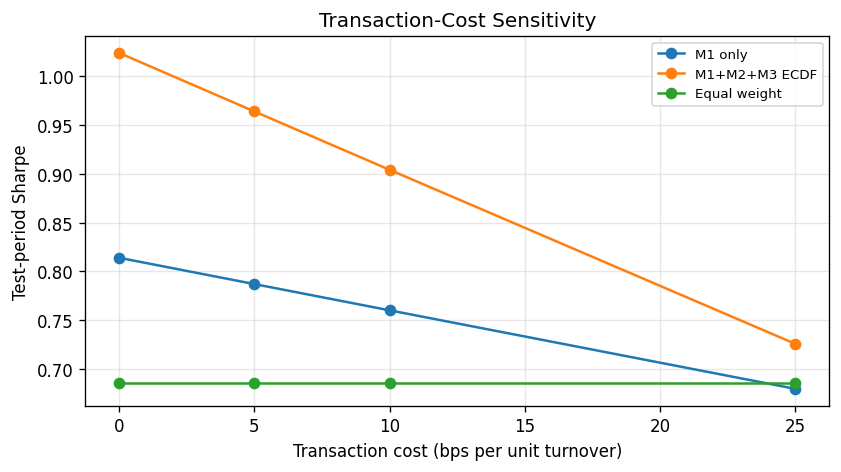

# Extended Evaluation: Walk-Forward & Transaction Costs

**Research use only — not investment advice.**

This report validates the M1+M2+M3 ECDF stack on **multiple out-of-sample windows** (expanding train, rolling 2-year test blocks) and measures **Sharpe sensitivity** to transaction costs versus M1-only and equal-weight baselines.

## Configuration

- Walk-forward enabled: `True`
- First train end: `2014-12-31`
- Test block length: `2` year(s)
- Transaction-cost grid (bps): `[0.0, 5.0, 10.0, 25.0]`
- Production test window: `2021-01-01` to `latest`

## Walk-forward validation

- **Mean ECDF Sharpe edge vs M1-only (across folds):** 0.1774
- **Mean M2 AUC (test, across folds):** 0.5482

| fold_id | train_start | train_end | test_start | test_end | test_weeks | m1_only_sharpe | m1_only_ann_return | ecdf_sharpe | ecdf_ann_return | ecdf_sharpe_edge_vs_m1 | ecdf_return_edge_vs_m1 | equal_weight_sharpe | m2_auc | m2_auc_pr | m2_n_trades |
| --- | --- | --- | --- | --- | --- | --- | --- | --- | --- | --- | --- | --- | --- | --- | --- |
| 1 | 2006-01-01 | 2014-12-31 | 2015-01-01 | 2016-12-31 | 105 | -0.0094 | -0.0008923839470185158 | -0.1971 | -0.013781333400998297 | -0.1876 | -0.012888949453979781 | 0.2059 | 0.4706 | 0.45987079840248785 | 315 |
| 2 | 2006-01-01 | 2016-12-31 | 2017-01-01 | 2018-12-31 | 104 | 1.0157 | 0.08520724688094616 | 1.7423 | 0.07003780945884275 | 0.7267 | -0.015169437422103416 | 0.5454 | 0.6306 | 0.6574411889849903 | 312 |
| 3 | 2006-01-01 | 2018-12-31 | 2019-01-01 | 2020-12-31 | 104 | 0.8053 | 0.09512725601098304 | 0.9956 | 0.06875242734885134 | 0.1903 | -0.0263748286621317 | 1.0119 | 0.5679 | 0.6523833876271765 | 312 |
| 4 | 2006-01-01 | 2020-12-31 | 2021-01-01 | 2022-12-31 | 105 | -0.0224 | -0.0025154097237640727 | 0.4018 | 0.027849882064907128 | 0.4242 | 0.0303652917886712 | -0.3229 | 0.5061 | 0.585656004393908 | 315 |
| 5 | 2006-01-01 | 2022-12-31 | 2023-01-01 | 2024-12-31 | 104 | 1.1563 | 0.10268718532076604 | 1.1882 | 0.07089353472713333 | 0.0319 | -0.031793650593632705 | 1.1535 | 0.6129 | 0.7016711786363587 | 312 |
| 6 | 2006-01-01 | 2024-12-31 | 2025-01-01 | 2026-06-12 | 76 | 1.5634 | 0.1880770021345919 | 1.4424 | 0.12741554701608715 | -0.1209 | -0.06066145511850474 | 1.7730 | 0.5011 | 0.6572920928238803 | 228 |

## Transaction-cost sensitivity (production test window)

| transaction_cost_bps | strategy | annualized_return | sharpe | max_drawdown | hit_rate | n_weeks | ecdf_sharpe_edge_vs_m1 |
| --- | --- | --- | --- | --- | --- | --- | --- |
| 0.0 | equal_weight_1_7 | 0.0734 | 0.6853 | -0.2390 | 0.5439 | 285 | — |
| 0.0 | m1_only | 0.0869 | 0.8139 | -0.2078 | 0.5965 | 285 | — |
| 0.0 | m1_m2_m3_ecdf | 0.0746 | 1.0242 | -0.1100 | 0.5930 | 285 | 0.2103 |
| 5.0 | equal_weight_1_7 | 0.0734 | 0.6853 | -0.2390 | 0.5439 | 285 | — |
| 5.0 | m1_only | 0.0840 | 0.7869 | -0.2100 | 0.5965 | 285 | — |
| 5.0 | m1_m2_m3_ecdf | 0.0702 | 0.9641 | -0.1133 | 0.5930 | 285 | 0.1772 |
| 10.0 | equal_weight_1_7 | 0.0734 | 0.6853 | -0.2390 | 0.5439 | 285 | — |
| 10.0 | m1_only | 0.0812 | 0.7600 | -0.2130 | 0.5895 | 285 | — |
| 10.0 | m1_m2_m3_ecdf | 0.0658 | 0.9042 | -0.1166 | 0.5895 | 285 | 0.1442 |
| 25.0 | equal_weight_1_7 | 0.0734 | 0.6853 | -0.2390 | 0.5439 | 285 | — |
| 25.0 | m1_only | 0.0726 | 0.6794 | -0.2222 | 0.5825 | 285 | — |
| 25.0 | m1_m2_m3_ecdf | 0.0528 | 0.7255 | -0.1281 | 0.5754 | 285 | 0.0462 |

- ECDF Sharpe edge vs M1-only **does not persist** at 25 bps under this test window.