# Final Report: AI-Augmented Multi-Asset Meta-Labeling Pipeline

This run executes the pipeline **twice**: once with M1 **long-only** (no short signals) and once with M1 **long/short** enabled.

**Research use only — not investment advice.**

## Sample Period

| Item | Value |
| --- | --- |
| Effective start | 2011-06-03 |
| Effective end | 2026-07-10 |
| Data download from | 2000-01-01 |
| Train period (requested) | 2006-01-01 to 2020-12-31 |
| Test period (M2 evaluation) | 2021-01-01 to latest |
| Universe mode | all 7 index sleeves each week |
| Assets | SP500, MSCI_EAFE, MSCI_EM, UST_7_10, US_HIGH_YIELD, GOLD_SPOT, US_REIT |

## Configuration Parameters Affecting Performance

The pipeline reads defaults from `config/config.yaml`. **Split dates** can also be set at runtime without editing the file (see CLI below). Other parameters require config edits.

### Train / Test Split

| Parameter | Current value | Performance impact |
| --- | --- | --- |
| `split.data_start` | 2000-01-01 | Earliest downloaded price date (can precede train for feature warmup) |
| `split.train_start` | 2006-01-01 | Intended train window start (clipped to effective panel start) |
| `split.train_end` | 2020-12-31 | Last in-sample date; **primary knob for tuning in-sample fit** |
| `split.test_start` | 2021-01-01 | Out-of-sample evaluation begins here (M2 metrics, IC, and test-period strategy tables) |
| `split.test_end` | latest (open-ended) | Optional cap on the evaluation window |
| `split.require_full_universe` | True | If true, only weeks with all 7 sleeves (~2011+); if false, partial groups allowed |

**Can train_start be before 2006?** Yes in config/CLI, but with `require_full_universe: true` (default) the **effective** sample starts when all seven index/proxy sleeves have sufficient public data coverage both exist. Dates before that are dropped. Set `require_full_universe: false` or `--partial-universe` to train on subsets when earlier public proxy coverage is incomplete.

**CLI overrides** (ISO dates, applied after loading config):

```bash
# Shorter/longer train, earlier/later test — compare Sharpe in reports/final_report.md
python -m src.run_pipeline --train-end 2018-12-31 --test-start 2019-01-01
python -m src.run_pipeline --train-end 2015-12-31 --test-start 2016-01-01
python -m src.run_pipeline --train-start 2008-01-01 --train-end 2012-12-31 --test-start 2013-01-01

# Earlier history: partial universe before all seven index/proxy sleeves have sufficient public data coverageed
python -m src.run_pipeline --data-start 2004-01-01 --train-start 2005-01-01 --train-end 2006-12-31 --test-start 2007-01-01 --partial-universe --refresh-data
```

Shorter train windows reduce overfitting risk but give fewer M2 labels; varying `train_end` is the fastest way to test whether performance is stable across in-sample cutoffs.

### M1 Rule-Based Side Model

| Parameter | Current value | Performance impact |
| --- | --- | --- |
| `models.m1.weights` | momentum=0.45, trend=0.25, macro=0.2, risk=0.1 | Relative importance of factor families in the composite score |
| `models.m1.optimize_thresholds` | True | When true, long/short cutoffs are tuned on the train set only |
| `models.m1.long_quantile` / `short_quantile` | 0.58 / 0.22 | Starting quantiles for threshold search (higher long quantile → fewer longs) |
| `models.m1.allow_short` | False | Default shorting flag; pipeline always runs both long-only and long/short modes |
| `models.m1.asset_class_tilts` | True | Macro tilts by asset class (equity, bonds, credit, gold, REIT) |
| `models.m1.allocation_mode` | top_k | `threshold` (absolute cutoffs) or `top_k` (weekly cross-sectional rank) |
| `models.m1.top_k` | 3 | Number of names to long each week when `allocation_mode=top_k` |
| `models.m1.conviction_sizing` | False | Scale weights by normalized M1 score before M2 sizing |
| `models.m1.tune_objective` | portfolio | `trade` or `portfolio` Sharpe for threshold tuning (threshold mode only) |

### M2 Meta-Labeling

| Parameter | Current value | Performance impact |
| --- | --- | --- |
| `models.m2.threshold` | 0.55 | Minimum P(success) to take full size; higher → fewer trades, often lower turnover |
| `models.m2.calibrate` | True | Probability calibration on train data; improves threshold interpretability |
| `models.m2.type` | logistic_regression | Classifier used for meta-labels |

### Labels (M1 targets & M2 supervision)

| Parameter | Current value | Performance impact |
| --- | --- | --- |
| `labels.horizon_weeks` | 4 | Forward return horizon for profitability labels |
| `labels.positive_threshold` | 0.005 | Minimum forward return to label a long as successful |
| `labels.negative_threshold` | -0.005 | Forward return threshold for short success |
| `labels.transaction_cost_threshold` | 0.001 | Cost hurdle embedded in label construction |

### Portfolio & Costs

| Parameter | Current value | Performance impact |
| --- | --- | --- |
| `portfolio.transaction_cost_bps` | 5 | Round-trip cost per unit turnover; higher values drag net returns |
| `portfolio.max_gross_exposure` | 1.0 | Cap on sum of absolute weights |
| `portfolio.max_abs_asset_weight` | 0.25 | Per-asset weight ceiling |
| `portfolio.sizing_mode` | linear | Default M3 bet-sizing rule (binary / linear / ecdf) |
| `models.m3.mode` | linear | M3 sizing rule applied to M2 probabilities (Joubert bet-sizing layer) |
| `models.m3.threshold` | 0.55 | M3 binary threshold T (all-or-nothing sizing only) |
| `portfolio.vol_target_ann` | 0.12 | Annualized vol target for gross scaling (null disables) |
| `portfolio.vol_target_lookback_weeks` | 26 | Trailing window for realized vol estimate |

### Features

| Parameter | Current value | Performance impact |
| --- | --- | --- |
| `features.momentum_windows` | [4, 12, 26, 52] | Lookback weeks for momentum factors |
| `features.macro_lag_weeks` | 4 | Release lag applied to macro series (reduces look-ahead) |
| `features.winsorize_pct` | 0.01 | Train-set winsorization of extreme feature values |

## Data & Components Used

The pipeline combines **seven index sleeves** (asset-class benchmarks) plus **macro/risk indicators** for regime features. Prices are resampled to **weekly** (Friday close) from daily adjusted-close data.

| Field | Value |
| --- | --- |
| Sample start | 2011-06-03 |
| Sample end | 2026-07-10 |
| Frequency | Weekly (W-FRI) |
| Price field | Adjusted close |

### Index Sleeves (tradable universe)

| Ticker | Instrument | Proxy / Benchmark | Asset Class | Role in Portfolio | Data Source |
| --- | --- | --- | --- | --- | --- |
| SP500 | S&P 500 Index | S&P 500 Index (^GSPC) | Equity | U.S. large-cap equity index sleeve | Yahoo Finance |
| MSCI_EAFE | MSCI EAFE Index Proxy | MSCI EAFE public proxy (EFA) | Equity | developed international equity index sleeve | Yahoo Finance |
| MSCI_EM | MSCI Emerging Markets Index Proxy | MSCI Emerging Markets public proxy (EEM) | Equity | emerging markets equity index sleeve | Yahoo Finance |
| UST_7_10 | U.S. Treasury 7-10 Year Index Proxy | U.S. Treasury 7-10 Year public proxy (IEF) | Fixed Income | intermediate Treasury duration sleeve | Yahoo Finance |
| US_HIGH_YIELD | U.S. High Yield Bond Index Proxy | U.S. High Yield public proxy (HYG) | Fixed Income | credit risk and high-yield fixed income sleeve | Yahoo Finance |
| GOLD_SPOT | Gold Spot / Gold Index Proxy | Gold futures / spot proxy (GC=F) | Commodity | commodity and inflation-hedging sleeve | Yahoo Finance |
| US_REIT | U.S. REIT Index | NASDAQ U.S. Benchmark REIT Index | Real Estate | real estate equity index sleeve | FRED: NASDAQNQUSB351020 |

### Macro & Risk Indicators (features only)

These series are **not traded** in the backtest. They feed M1/M2 regime and false-positive features, lagged by 4 weeks to approximate publication delay.

| Series | Description | Use | Source |
| --- | --- | --- | --- |
| CPIAUCSL | Consumer Price Index | Inflation trend and regime indicator | FRED — lagged 4 weeks in features |
| UNRATE | Unemployment Rate | Labor market / growth proxy | FRED — lagged 4 weeks in features |
| INDPRO | Industrial Production Index | Economic growth proxy | FRED — lagged 4 weeks in features |
| FEDFUNDS | Federal Funds Rate | Monetary policy stance | FRED — lagged 4 weeks in features |
| DGS10 | 10-Year Treasury Yield | Long-term interest rate level | FRED — lagged 4 weeks in features |
| T10Y2Y | 10Y–2Y Treasury Spread | Yield curve slope / recession signal | FRED — lagged 4 weeks in features |
| BAA10Y | Baa–10Y Credit Spread | Credit stress indicator | FRED — lagged 4 weeks in features |
| VIX | CBOE Volatility Index | Equity risk sentiment (risk-on / risk-off) | yfinance (^VIX) — used in features, not traded |

## Individual Asset Performance (Buy-and-Hold)

Each row below is a **standalone buy-and-hold** of one index sleeve: 100% allocated to that asset, rebalanced weekly, **no transaction costs**, no M1/M2 overlay. This shows how each building block performed on its own before any strategy logic. Charts also overlay **M1** and **M1+M2** portfolio models (long-only and long/short) for comparison.

### Full Sample

| Ticker | Asset | Class | Ann. Return | Ann. Volatility | Sharpe | Max Drawdown | Total Return | Weekly Hit Rate |
| --- | --- | --- | --- | --- | --- | --- | --- | --- |
| SP500 | S&P 500 Index | Equity | 12.2423% | 16.2364% | 0.7540 | -31.8103% | 475.5222% | 58.5025% |
| MSCI_EAFE | MSCI EAFE Index Proxy | Equity | 6.7988% | 17.1525% | 0.3964 | -33.4150% | 170.9527% | 55.8376% |
| MSCI_EM | MSCI Emerging Markets Index Proxy | Equity | 4.4273% | 19.6649% | 0.2251 | -39.1578% | 92.7985% | 53.8071% |
| UST_7_10 | U.S. Treasury 7-10 Year Index Proxy | Fixed Income | 1.9271% | 6.3495% | 0.3035 | -23.2555% | 33.5420% | 54.4416% |
| US_HIGH_YIELD | U.S. High Yield Bond Index Proxy | Fixed Income | 4.7054% | 9.0782% | 0.5183 | -20.7473% | 100.7274% | 58.1218% |
| GOLD_SPOT | Gold Spot / Gold Index Proxy | Commodity | 6.6472% | 16.2561% | 0.4089 | -43.6303% | 165.1813% | 54.9492% |
| US_REIT | U.S. REIT Index | Real Estate | 3.6860% | 20.1949% | 0.1825 | -39.9657% | 73.0690% | 53.8071% |

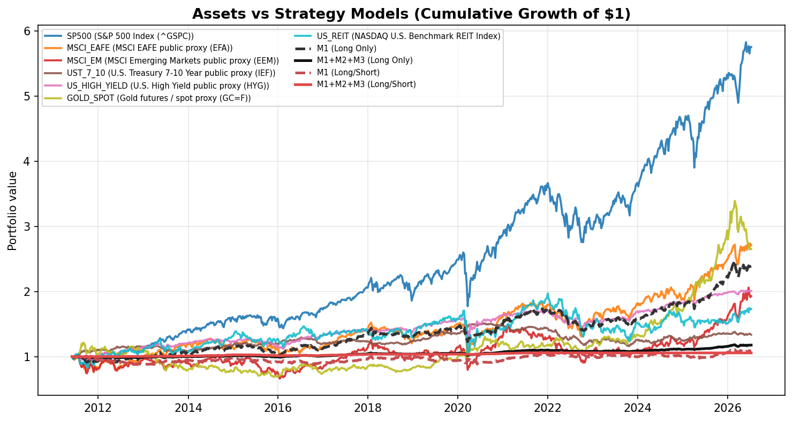

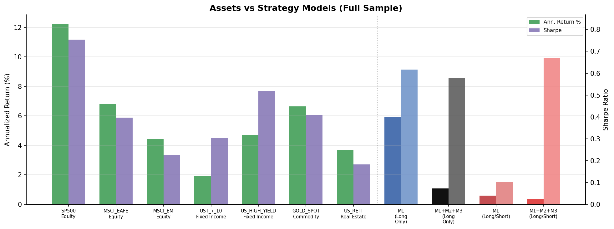

### Train Period (2006-01-01 to 2020-12-31)

| Ticker | Asset | Class | Ann. Return | Ann. Volatility | Sharpe | Max Drawdown | Total Return | Weekly Hit Rate |
| --- | --- | --- | --- | --- | --- | --- | --- | --- |
| SP500 | S&P 500 Index | Equity | 11.5243% | 16.4455% | 0.7008 | -31.8103% | 184.8157% | 59.7194% |
| MSCI_EAFE | MSCI EAFE Index Proxy | Equity | 5.0103% | 17.7039% | 0.2830 | -33.4150% | 59.8619% | 55.1102% |
| MSCI_EM | MSCI Emerging Markets Index Proxy | Equity | 2.7042% | 20.3061% | 0.1332 | -36.6879% | 29.1823% | 52.5050% |
| UST_7_10 | U.S. Treasury 7-10 Year Index Proxy | Fixed Income | 4.1628% | 5.8635% | 0.7100 | -8.5046% | 47.9020% | 57.1142% |
| US_HIGH_YIELD | U.S. High Yield Bond Index Proxy | Fixed Income | 5.2681% | 10.1607% | 0.5185 | -20.7473% | 63.6672% | 60.5210% |
| GOLD_SPOT | Gold Spot / Gold Index Proxy | Commodity | 2.0883% | 16.1884% | 0.1290 | -43.6303% | 21.9368% | 52.9058% |
| US_REIT | U.S. REIT Index | Real Estate | 3.7112% | 21.2509% | 0.1746 | -39.9657% | 41.8622% | 55.9118% |

### Test Period (2021-01-01 to latest)

| Ticker | Asset | Class | Ann. Return | Ann. Volatility | Sharpe | Max Drawdown | Total Return | Weekly Hit Rate |
| --- | --- | --- | --- | --- | --- | --- | --- | --- |
| SP500 | S&P 500 Index | Equity | 13.4929% | 15.8962% | 0.8488 | -24.8230% | 102.0683% | 56.4014% |
| MSCI_EAFE | MSCI EAFE Index Proxy | Equity | 9.9590% | 16.1793% | 0.6155 | -28.8835% | 69.4917% | 57.0934% |
| MSCI_EM | MSCI Emerging Markets Index Proxy | Equity | 7.4707% | 18.5344% | 0.4031 | -39.1578% | 49.2453% | 56.0554% |
| UST_7_10 | U.S. Treasury 7-10 Year Index Proxy | Fixed Income | -1.8209% | 7.0924% | -0.2567 | -21.7531% | -9.7091% | 49.8270% |
| US_HIGH_YIELD | U.S. High Yield Bond Index Proxy | Fixed Income | 3.7409% | 6.8301% | 0.5477 | -15.3952% | 22.6436% | 53.9792% |
| GOLD_SPOT | Gold Spot / Gold Index Proxy | Commodity | 15.0032% | 16.3472% | 0.9178 | -22.0208% | 117.4743% | 58.4775% |
| US_REIT | U.S. REIT Index | Real Estate | 3.6424% | 18.2635% | 0.1994 | -37.3946% | 21.9980% | 50.1730% |

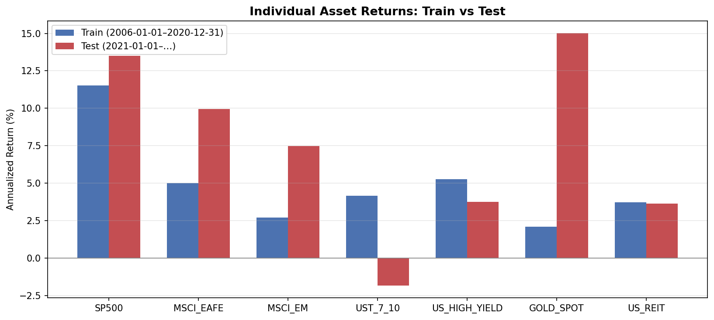

### Per-Asset Highlights

- **SP500** (S&P 500 Index (^GSPC)): 12.2423% annualized, Sharpe 0.7540, max drawdown -31.8103% — U.S. large-cap equity index sleeve.
- **MSCI_EAFE** (MSCI EAFE public proxy (EFA)): 6.7988% annualized, Sharpe 0.3964, max drawdown -33.4150% — developed international equity index sleeve.
- **GOLD_SPOT** (Gold futures / spot proxy (GC=F)): 6.6472% annualized, Sharpe 0.4089, max drawdown -43.6303% — commodity and inflation-hedging sleeve.
- **US_HIGH_YIELD** (U.S. High Yield public proxy (HYG)): 4.7054% annualized, Sharpe 0.5183, max drawdown -20.7473% — credit risk and high-yield fixed income sleeve.
- **MSCI_EM** (MSCI Emerging Markets public proxy (EEM)): 4.4273% annualized, Sharpe 0.2251, max drawdown -39.1578% — emerging markets equity index sleeve.
- **US_REIT** (NASDAQ U.S. Benchmark REIT Index): 3.6860% annualized, Sharpe 0.1825, max drawdown -39.9657% — real estate equity index sleeve.
- **UST_7_10** (U.S. Treasury 7-10 Year public proxy (IEF)): 1.9271% annualized, Sharpe 0.3035, max drawdown -23.2555% — intermediate Treasury duration sleeve.

See also: [assets/asset_component_analysis.md](assets/asset_component_analysis.md) for the full standalone write-up.

## M2 Performance by M1 Signal

M1 outputs three signal types per asset-week: **short (−1)**, **flat (0)**, or **long (+1)**. M2 only trains and predicts on non-zero signals. Below we break out **test-set** trade outcomes and classifier quality within each M1 group.

- **M1 hit rate**: share of trades with positive forward return (after cost hurdle)
- **M2 approval rate**: share of trades where `p_success` ≥ threshold
- **Hit rate (M2 approved)**: profitability among trades M2 kept

### Long-Only vs Long/Short Comparison

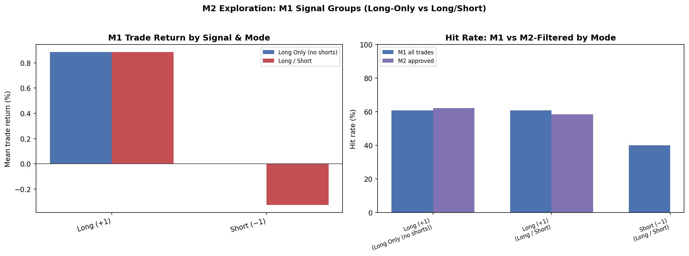

*Left: mean forward trade return by M1 signal. Right: M1 vs M2-filtered hit rates (long-only has no short bucket).*

### Long Only (no shorts)

`allow_short=False` — M2 threshold = 0.55

| M1 Signal | Observations | Share | Labeled Trades | M1 Hit Rate | Mean Trade Return | M2 Approval Rate | Hit Rate (M2 Approved) | M2 Precision | M2 Recall | M2 F1 |
| --- | --- | --- | --- | --- | --- | --- | --- | --- | --- | --- |
| Flat (0) | 1156 | 57.1429% | 0 | — | — | — | — | — | — | — |
| Long (+1) | 867 | 42.8571% | 867 | 60.7843% | 0.8857% | 82.5836% | 62.1508% | 0.6215 | 0.8444 | 0.7160 |

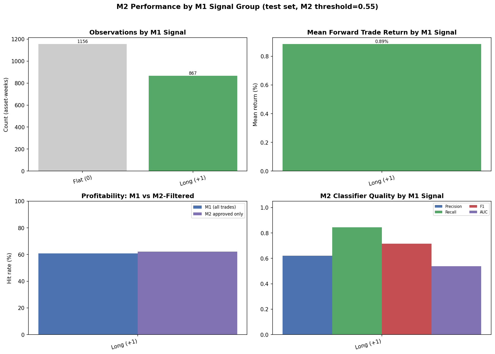
*Long-only mode: M1 never emits −1; shorts are disabled at the signal layer.*

### Long / Short

`allow_short=True` — M2 threshold = 0.55

| M1 Signal | Observations | Share | Labeled Trades | M1 Hit Rate | Mean Trade Return | M2 Approval Rate | Hit Rate (M2 Approved) | M2 Precision | M2 Recall | M2 F1 |
| --- | --- | --- | --- | --- | --- | --- | --- | --- | --- | --- |
| Short (−1) | 867 | 42.8571% | 867 | 40.0231% | -0.3260% | 0.0000% | — | 0.0000 | 0.0000 | 0.0000 |
| Flat (0) | 289 | 14.2857% | 0 | — | — | — | — | — | — | — |
| Long (+1) | 867 | 42.8571% | 867 | 60.7843% | 0.8857% | 5.5363% | 58.3333% | 0.5833 | 0.0531 | 0.0974 |

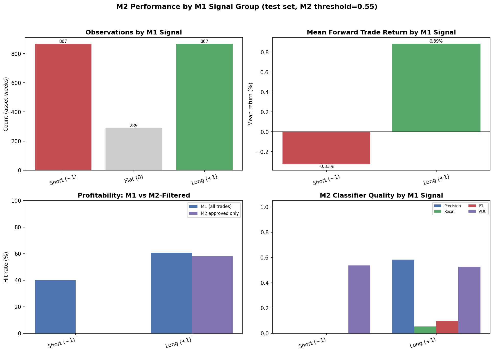
## M1 Mode Comparison (M1 Only)

| Mode | Ann. Return | Sharpe | Max Drawdown |
| --- | --- | --- | --- |
| Long Only (no shorts) | 5.9134% | 0.6170 | -20.1652% |
| Long / Short | 0.5871% | 0.1005 | -13.1609% |

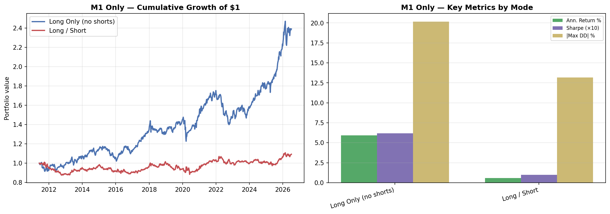

*Left: cumulative M1-only returns. Right: return, Sharpe (×10), and drawdown by mode.*

## M1 Exposure & Signal Quality Diagnostics

Understanding **how much capital M1 deploys** versus benchmark buy-and-hold helps separate low return from low edge.

### Portfolio Exposure (M1 only)

| Metric | Value |
| --- | --- |
| Mean gross exposure | 82.9161% |
| Median gross exposure | 85.7142% |
| Mean implied cash (1 − gross) | 17.0839% |
| Mean active names per week | 3.00 |
| Weeks below 50% invested | 3.4221% |
| Mean gross vs equal-weight | -16.9572% |

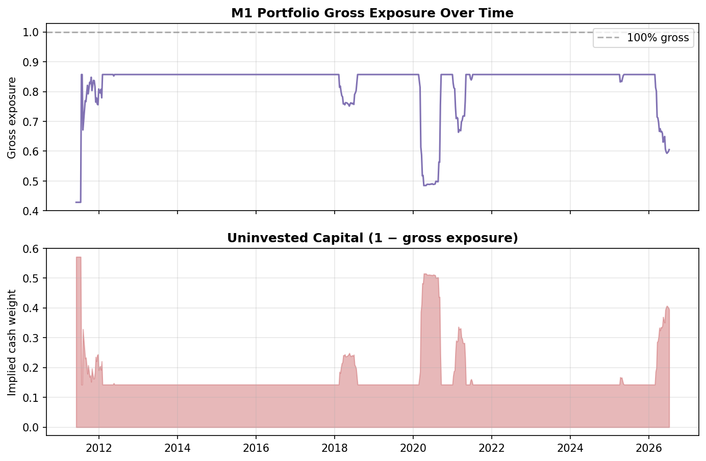

### Per-Asset IC (M1 score vs forward return)

| Ticker | IC | Observations | Hit rate (active) |
| --- | --- | --- | --- |
| MSCI_EM | 0.1803 | 285 | 63.2184% |
| MSCI_EAFE | 0.0571 | 285 | 61.1111% |
| GOLD_SPOT | 0.0224 | 285 | 62.5571% |
| US_HIGH_YIELD | 0.0129 | 285 | 75.7576% |
| SP500 | -0.0993 | 285 | 65.4822% |
| US_REIT | -0.1197 | 285 | 50.5747% |
| UST_7_10 | -0.1203 | 285 | 40.8163% |

### Threshold sensitivity (train period)

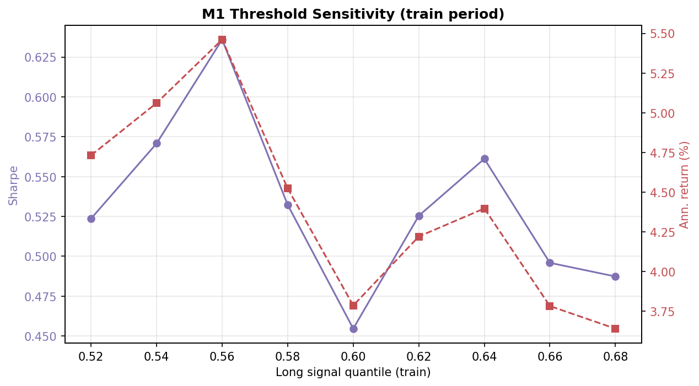

## Results: Long Only (no shorts)

`allow_short=False` — outputs in `data/backtests/long_only/`

### Full-Sample Strategy Metrics

These metrics cover the full effective panel, including train and test periods. They are useful for long-run behavior but should not be read as pure OOS performance.

| Strategy | Ann. Return | Ann. Volatility | Sharpe | Max Drawdown | Excess vs EW | Info Ratio | Weekly Hit Rate |
| --- | --- | --- | --- | --- | --- | --- | --- |
| Equal Weight (1/7) | 6.5241% | 11.1747% | 0.5838 | -22.8949% | 0.0000% | 0.0000 | 56.9075% |
| 60/40 Benchmark | 5.8803% | 11.2552% | 0.5225 | -23.8647% | -0.6437% | -0.2638 | 57.4144% |
| M1 Only | 5.9134% | 9.5848% | 0.6170 | -20.1652% | -0.6107% | -0.1209 | 58.4284% |
| M1 + M2 + M3 (Binary threshold) | 5.6605% | 9.1647% | 0.6176 | -18.2063% | -0.8636% | -0.1469 | 55.7668% |
| M1 + M2 + M3 (Linear) | 1.0753% | 1.8609% | 0.5778 | -3.9579% | -5.4488% | -0.5991 | 57.2877% |
| M1 + M2 + M3 (ECDF) | 1.8085% | 5.4534% | 0.3316 | -13.1127% | -4.7156% | -0.5725 | 55.5133% |
| M1 + M2 + M3 (Passthrough diagnostic) | 3.8344% | 5.8895% | 0.6511 | -11.4752% | -2.6897% | -0.4350 | 57.9214% |

### Test-Period Strategy Metrics

These metrics start at `2021-01-01` and are the cleanest portfolio-level OOS view in this report.

| Strategy | Ann. Return | Ann. Volatility | Sharpe | Max Drawdown | Excess vs EW | Info Ratio | Weekly Hit Rate |
| --- | --- | --- | --- | --- | --- | --- | --- |
| Equal Weight (1/7) | 7.8149% | 10.4964% | 0.7445 | -22.3385% | 0.0000% | 0.0000 | 56.4014% |
| 60/40 Benchmark | 5.9197% | 10.4629% | 0.5658 | -23.5054% | -1.8952% | -0.7847 | 55.0173% |
| M1 Only | 8.9206% | 10.1901% | 0.8754 | -20.1652% | 1.1057% | 0.2038 | 59.8616% |
| M1 + M2 + M3 (Binary threshold) | 8.6732% | 9.1219% | 0.9508 | -14.4468% | 0.8584% | 0.0917 | 53.2872% |
| M1 + M2 + M3 (Linear) | 1.7718% | 1.8174% | 0.9749 | -2.3934% | -6.0431% | -0.6857 | 59.1696% |
| M1 + M2 + M3 (ECDF) | 4.5847% | 5.0175% | 0.9137 | -7.5122% | -3.2302% | -0.4007 | 55.0173% |
| M1 + M2 + M3 (Passthrough diagnostic) | 5.6507% | 6.1511% | 0.9186 | -11.4752% | -2.1642% | -0.4027 | 59.5156% |

### Charts (Long Only (no shorts))

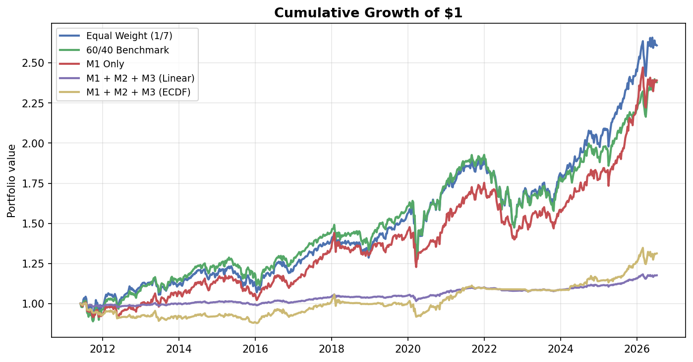

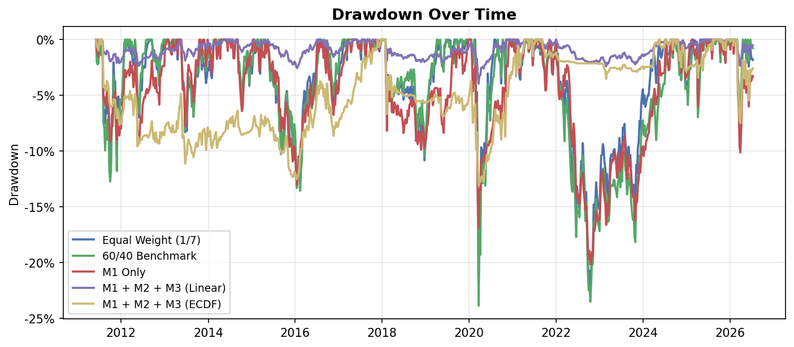

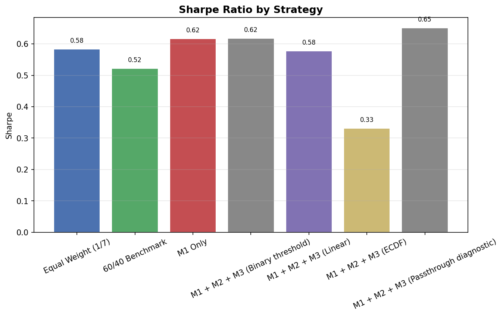

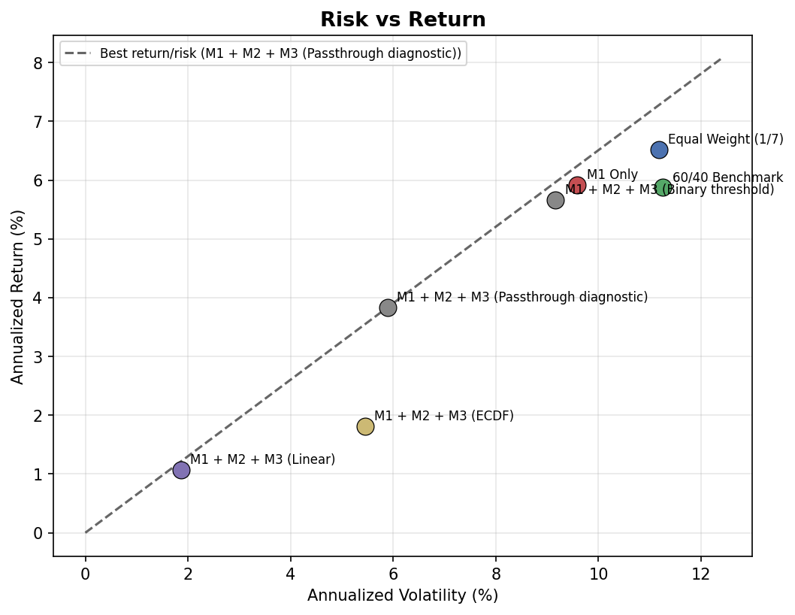

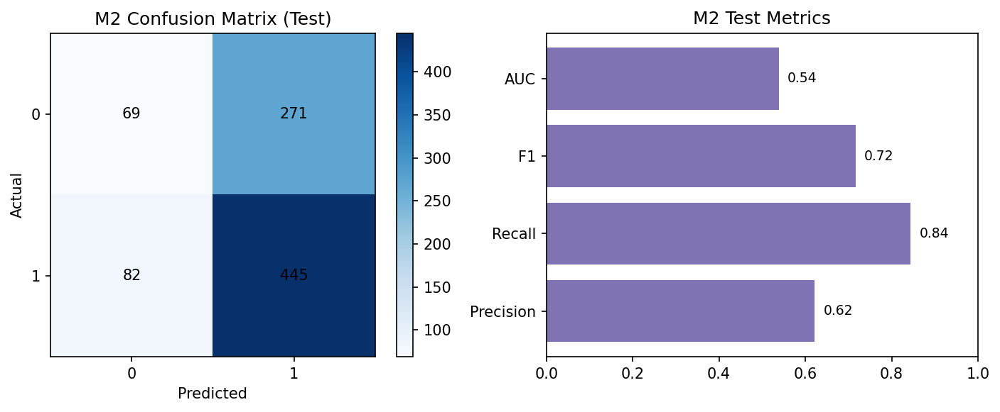


### M2 Quality — Long Only (no shorts) (Test Set)

| Metric | Value | Meaning |
| --- | --- | --- |
| Accuracy | 0.5928 | Share of correct meta-label predictions |
| Precision | 0.6215 | Approved trades that were actually profitable |
| Recall | 0.8444 | Profitable trades that M2 approved |
| F1 Score | 0.7160 | Balance of precision and recall |
| AUC-ROC | 0.5389 | Ranking quality: P(random winner scored higher than random loser) |
| AUC-PR | 0.6203 | Precision-recall AUC; more informative when base rate ≠ 50% |
| Base Rate | 60.7843% | Fraction of M1 trades that beat the cost hurdle |
| Brier Score | 0.2387 | Probability calibration error (lower is better) |
| Mean P (winners) | 0.5770 | Average M2 probability on profitable trades |
| Mean P (losers) | 0.5738 | Average M2 probability on unprofitable trades |
| Mean IC | 0.0972 | Spearman rank correlation of M1 scores vs forward returns |

## Results: Long / Short

`allow_short=True` — outputs in `data/backtests/long_short/`

### Full-Sample Strategy Metrics

These metrics cover the full effective panel, including train and test periods. They are useful for long-run behavior but should not be read as pure OOS performance.

| Strategy | Ann. Return | Ann. Volatility | Sharpe | Max Drawdown | Excess vs EW | Info Ratio | Weekly Hit Rate |
| --- | --- | --- | --- | --- | --- | --- | --- |
| Equal Weight (1/7) | 6.5241% | 11.1747% | 0.5838 | -22.8949% | 0.0000% | 0.0000 | 56.9075% |
| 60/40 Benchmark | 5.8803% | 11.2552% | 0.5225 | -23.8647% | -0.6437% | -0.2638 | 57.4144% |
| M1 Only | 0.5871% | 5.8408% | 0.1005 | -13.1609% | -5.9370% | -0.4542 | 51.7110% |
| M1 + M2 + M3 (Binary threshold) | 1.8366% | 3.0765% | 0.5970 | -11.3554% | -4.6875% | -0.4767 | 22.4335% |
| M1 + M2 + M3 (Linear) | 0.3608% | 0.5402% | 0.6678 | -1.6290% | -6.1633% | -0.6022 | 41.9518% |
| M1 + M2 + M3 (ECDF) | 3.0218% | 4.5045% | 0.6708 | -7.2400% | -3.5023% | -0.3825 | 56.4005% |
| M1 + M2 + M3 (Passthrough diagnostic) | 1.0665% | 4.7518% | 0.2245 | -10.4339% | -5.4575% | -0.4589 | 52.0913% |

### Test-Period Strategy Metrics

These metrics start at `2021-01-01` and are the cleanest portfolio-level OOS view in this report.

| Strategy | Ann. Return | Ann. Volatility | Sharpe | Max Drawdown | Excess vs EW | Info Ratio | Weekly Hit Rate |
| --- | --- | --- | --- | --- | --- | --- | --- |
| Equal Weight (1/7) | 7.8149% | 10.4964% | 0.7445 | -22.3385% | 0.0000% | 0.0000 | 56.4014% |
| 60/40 Benchmark | 5.9197% | 10.4629% | 0.5658 | -23.5054% | -1.8952% | -0.7847 | 55.0173% |
| M1 Only | 2.8501% | 5.3917% | 0.5286 | -8.9454% | -4.9648% | -0.4467 | 55.0173% |
| M1 + M2 + M3 (Binary threshold) | 0.8184% | 1.4724% | 0.5558 | -2.4535% | -6.9965% | -0.7030 | 7.2664% |
| M1 + M2 + M3 (Linear) | 0.1771% | 0.3324% | 0.5327 | -0.4840% | -7.6378% | -0.7605 | 19.3772% |
| M1 + M2 + M3 (ECDF) | 2.8889% | 3.5438% | 0.8152 | -5.7322% | -4.9260% | -0.5793 | 60.2076% |
| M1 + M2 + M3 (Passthrough diagnostic) | 2.7407% | 4.2483% | 0.6451 | -6.2876% | -5.0742% | -0.4989 | 55.3633% |

### Charts (Long / Short)

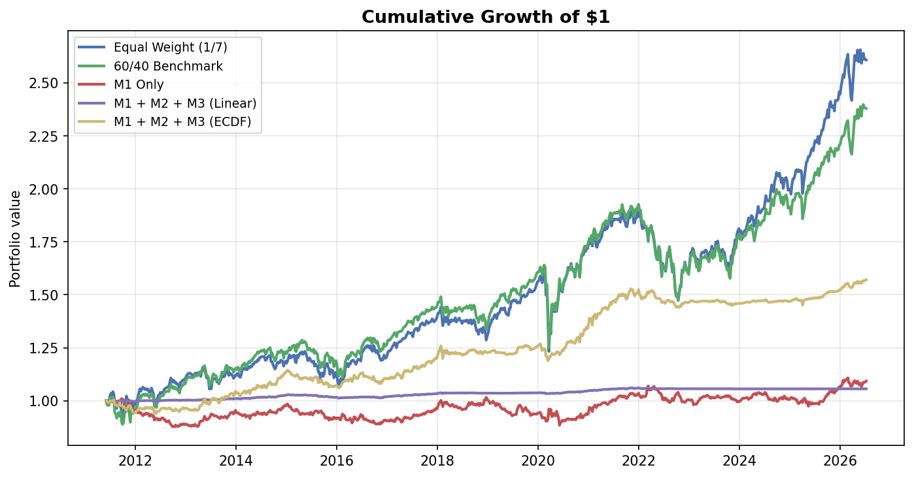

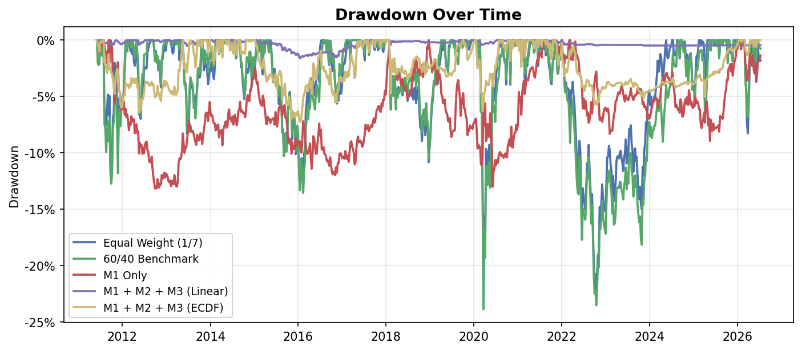

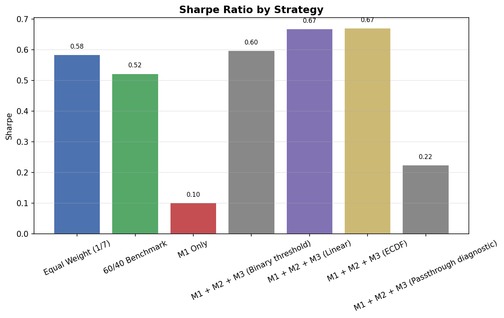

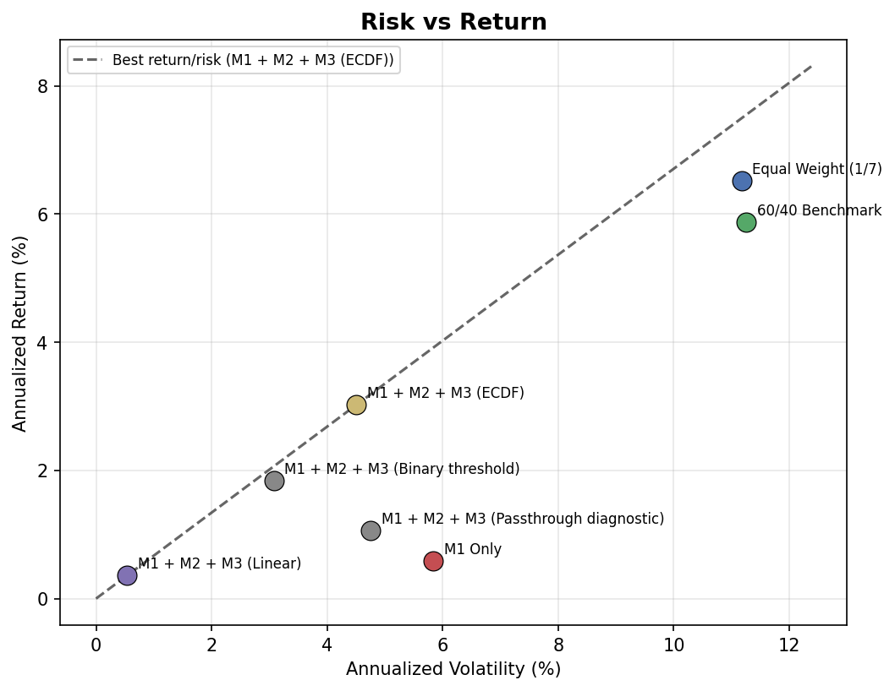

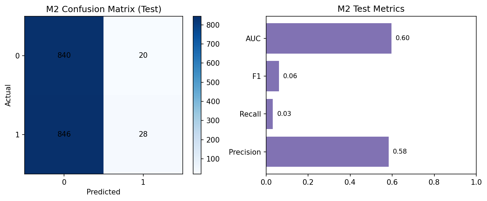


### M2 Quality — Long / Short (Test Set)

| Metric | Value | Meaning |
| --- | --- | --- |
| Accuracy | 0.5006 | Share of correct meta-label predictions |
| Precision | 0.5833 | Approved trades that were actually profitable |
| Recall | 0.0320 | Profitable trades that M2 approved |
| F1 Score | 0.0607 | Balance of precision and recall |
| AUC-ROC | 0.5964 | Ranking quality: P(random winner scored higher than random loser) |
| AUC-PR | 0.5759 | Precision-recall AUC; more informative when base rate ≠ 50% |
| Base Rate | 50.4037% | Fraction of M1 trades that beat the cost hurdle |
| Brier Score | 0.2472 | Probability calibration error (lower is better) |
| Mean P (winners) | 0.4613 | Average M2 probability on profitable trades |
| Mean P (losers) | 0.4461 | Average M2 probability on unprofitable trades |
| Mean IC | 0.0972 | Spearman rank correlation of M1 scores vs forward returns |

### How to read the metrics

| Metric | Interpretation |
| --- | --- |
| **Ann. Return** | Geometric average yearly portfolio return after transaction costs |
| **Ann. Volatility** | Standard deviation of weekly returns, scaled to a year |
| **Sharpe** | Return per unit of risk (higher is better; assumes 0% risk-free rate) |
| **Max Drawdown** | Largest peak-to-trough loss over the displayed period |
| **Excess vs EW** | Strategy return minus equal-weight benchmark return |
| **Info Ratio** | Consistency of outperformance vs equal-weight |
| **Weekly Hit Rate** | Fraction of weeks with positive net strategy return |

## Deep Diagnostics

Branch update (vs `main`): [Executive summary](../BRANCH_UPDATE_REPORT.md) · [Technical report](branch_update_vitaly_week5.md)

**Terminology:** [TERMINOLOGY.md](../TERMINOLOGY.md) — plain-language glossary for finance and ML terms used in these reports.

Companion reports provide factor-level, M2 input, regime, M3 allocation, and AUC-ROC detail:

- [M1 Factor Analysis](m1_factor_analysis.md) — per-factor IC, correlation/covariance, sleeve backtests
- [M2 Diagnostics](m2_diagnostics.md) — calibration, decile returns, feature importance, AUC-ROC guide
- [M2 Feature Research](m2_feature_research.md) — M1 factor + external factor enrichment sweep
- [Market & Regime Analysis](market_regime_analysis.md) — regime timeline, transitions, conditioned performance
- [M3 Allocation Analysis](m3_allocation_analysis.md) — M1 vs M3=0 vs M3>0 states and sizing rules
- [M3 Threshold Analysis](m3_threshold_analysis.md) — binary/linear threshold sweep with rejection vs Sharpe trade-off
- [IR Attribution Analysis](ir_attribution_analysis.md) — why Info Ratio falls vs equal-weight when M2/M3 added
- [IR Improvement Research](ir_improvement_research.md) — intervention sweep and adoption verdict
- [Extended Evaluation](evaluation_analysis.md) — walk-forward folds and transaction-cost sensitivity
- [Walk-Forward Analysis](walk_forward_analysis.md) — ECDF edge stability across OOS windows

- **M1 factors (test):** strongest IC is `trend_score` (mean IC 0.1120).
- **M2 AUC-ROC (test, long-only):** 0.5389 — weak ranking quality; value is mainly in M3 ECDF sizing, not M3 binary threshold at 0.55.
- **Regime:** strategy Sharpe varies by `risk_off` / curve / inflation flags — see regime report.
- **Walk-forward ECDF edge:** mean -0.1898 (1/6 folds positive) — see [Walk-Forward Analysis](walk_forward_analysis.md).
- **M3 allocation (test):** 42.5111% of asset-weeks are M1 candidates with M3_size > 0 (active bets before portfolio constraints).
- **M1/M2/M3 stack:** M2 outputs P(success); M3 converts it to bet fraction; M3=0 with M1≠0 means a candidate was rejected by the sizing rule, not absent from M1.

## Key Takeaways

1. **Long-only M1** avoids short exposure, which often hurts in upward-trending equity samples.
2. **Long/short M1** can increase activity but shorts may reduce returns if poorly timed.
3. **M2 meta-labeling** adjusts position size on top of whichever M1 mode is used.
4. Compare both modes above to see whether shorts add value in this universe.

## Look-Ahead Controls

- Features use only data available at signal time (`shift(1)` on rolling windows)
- Macro series lagged 4 weeks to approximate release delay
- Strict chronological train/test split (train 2006-01-01–2020-12-31, test 2021-01-01–latest)

## Limitations

- yfinance and FRED are research-grade fallbacks, not institutional data
- Data provenance, ETL, validation, cache behavior, and fallback caveats are documented in `../DATA_SOURCES_AND_ETL.md`
- Past performance does not predict future results
