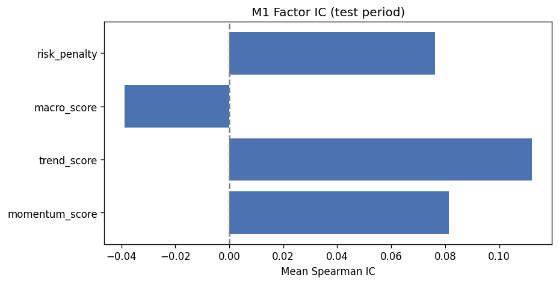
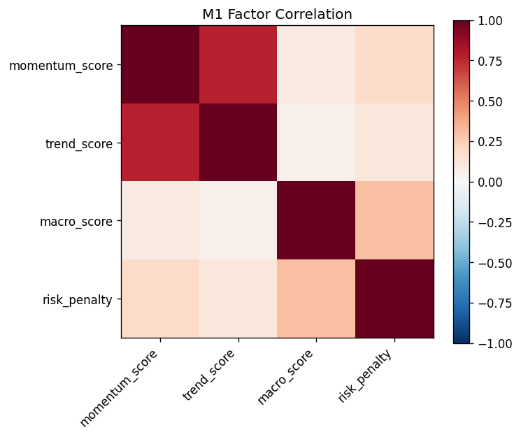
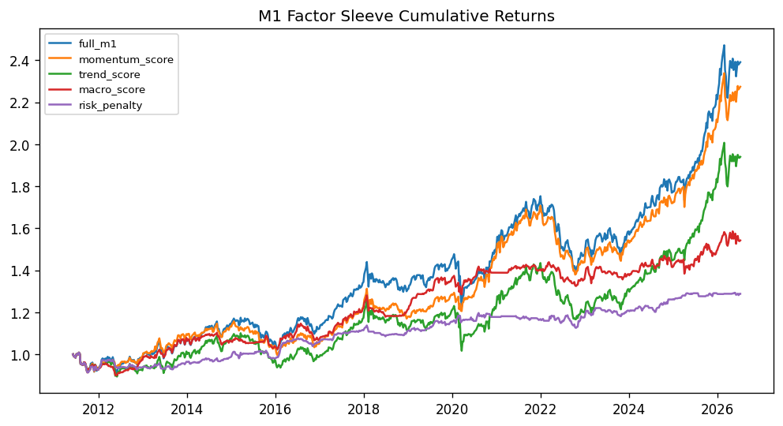
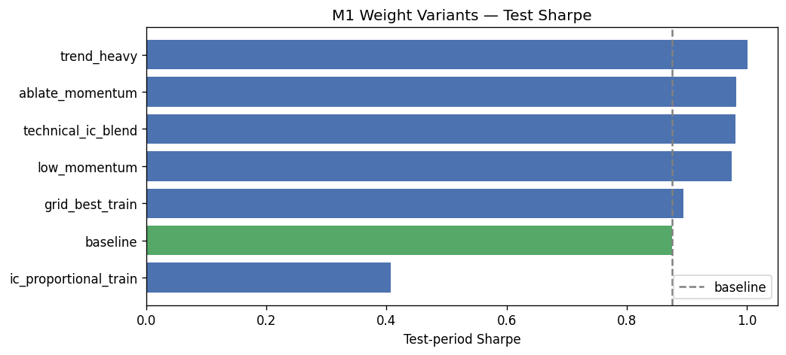

# M1 Factor Analysis

**Research use only — not investment advice.**

## Factor Weights

M1 composite score uses momentum **45%**, trend **25%**, macro **20%**, risk penalty **10%**.

## Per-Factor Information Coefficient

Spearman rank correlation of each component score vs 4-week forward return.

| period | factor | ic_mean | ic_std | ic_hit_rate | n_weeks |
| --- | --- | --- | --- | --- | --- |
| full | momentum_score | 0.0284 | 0.4913 | 0.5108 | 789 |
| full | trend_score | 0.0333 | 0.4874 | 0.4702 | 789 |
| full | macro_score | -0.0091 | 0.4497 | 0.4702 | 789 |
| full | risk_penalty | 0.0543 | 0.4561 | 0.5387 | 789 |
| full | M1_score | 0.0174 | 0.4873 | 0.4842 | 789 |
| train | momentum_score | -0.0026 | 0.5062 | 0.4900 | 500 |
| train | trend_score | -0.0155 | 0.5062 | 0.4160 | 500 |
| train | macro_score | 0.0079 | 0.4712 | 0.4820 | 500 |
| train | risk_penalty | 0.0415 | 0.4510 | 0.5300 | 500 |
| train | M1_score | -0.0281 | 0.4998 | 0.4460 | 500 |
| test | momentum_score | 0.0813 | 0.4609 | 0.5467 | 289 |
| test | trend_score | 0.1120 | 0.4451 | 0.5640 | 289 |
| test | macro_score | -0.0388 | 0.4084 | 0.4498 | 289 |
| test | risk_penalty | 0.0762 | 0.4646 | 0.5536 | 289 |
| test | M1_score | 0.0972 | 0.4546 | 0.5502 | 289 |

## Factor Correlation Matrix

| factor | momentum_score | trend_score | macro_score | risk_penalty |
| --- | --- | --- | --- | --- |
| momentum_score | 1.0 | 0.7806 | 0.0921 | 0.1906 |
| trend_score | 0.7806 | 1.0 | 0.0518 | 0.112 |
| macro_score | 0.0921 | 0.0518 | 1.0 | 0.2994 |
| risk_penalty | 0.1906 | 0.112 | 0.2994 | 1.0 |

## Factor Covariance Matrix

| factor | momentum_score | trend_score | macro_score | risk_penalty |
| --- | --- | --- | --- | --- |
| momentum_score | 0.121412 | 0.244046 | 0.012726 | 0.054547 |
| trend_score | 0.244046 | 0.805153 | 0.018431 | 0.082567 |
| macro_score | 0.012726 | 0.018431 | 0.157228 | 0.097543 |
| risk_penalty | 0.054547 | 0.082567 | 0.097543 | 0.674924 |

## Factor Sleeve Backtests

Each row is a portfolio using only that factor family for top-K selection (risk penalty inverted).

| sleeve | annualized_return | annualized_volatility | sharpe | max_drawdown | rolling_12m_max_drawdown | turnover | annualized_turnover | hit_rate | interaction_excess_ann | combined_excess_ann | sum_standalone_excess_ann |
| --- | --- | --- | --- | --- | --- | --- | --- | --- | --- | --- | --- |
| full_m1 | 5.9134% | 0.09584800614764315 | 0.6170 | -20.1652% | -0.2016521271186711 | 0.10484217846378821 | 5.451793280116987 | 0.5842839036755386 | nan | nan | nan |
| momentum_score | 5.5638% | 0.08286926385024976 | 0.6714 | -19.2003% | -0.19200286826690804 | 0.15120706359208586 | 7.862767306788465 | 0.5842839036755386 | nan | nan | nan |
| trend_score | 4.4648% | 0.09106471327781003 | 0.4903 | -19.0981% | -0.18686862203484234 | 0.08158918927092408 | 4.242637842088052 | 0.5678073510773131 | nan | nan | nan |
| macro_score | 2.8963% | 0.060581669101124884 | 0.4781 | -10.6525% | -0.10652475622230761 | 0.09928789850524845 | 5.162970722272919 | 0.5272496831432193 | nan | nan | nan |
| risk_penalty | 1.6819% | 0.03924222684760441 | 0.4286 | -9.3994% | -0.09399386345153093 | 0.12251380529842056 | 6.370717875517869 | 0.4512040557667934 | nan | nan | nan |
| interaction | — | nan | — | — | nan | nan | nan | nan | 0.10879021850528425 | -0.006106541549809386 | -0.11489676005509364 |

## Factor Ablation (zero one weight at a time)

| variant | annualized_return | annualized_volatility | sharpe | max_drawdown | rolling_12m_max_drawdown | turnover | annualized_turnover | hit_rate |
| --- | --- | --- | --- | --- | --- | --- | --- | --- |
| full_m1 | 5.9134% | 0.09584800614764315 | 0.6170 | -20.1652% | -0.2016521271186711 | 0.10484217846378821 | 5.451793280116987 | 0.5842839036755386 |
| ablate_momentum | 5.9158% | 0.09046132633242795 | 0.6540 | -15.6712% | -0.15671199349550624 | 0.09200246560723004 | 4.784128211575962 | 0.5779467680608364 |
| ablate_trend | 6.2332% | 0.08161592920227095 | 0.7637 | -16.5161% | -0.16516145555660744 | 0.15592140974963425 | 8.107913306980981 | 0.5804816223067174 |
| ablate_macro | 5.4997% | 0.09039404277215661 | 0.6084 | -18.1884% | -0.17748160686959802 | 0.09936824196949995 | 5.167148582413997 | 0.5817490494296578 |
| ablate_risk_penalty | 5.4371% | 0.09413036359586316 | 0.5776 | -17.8781% | -0.17878147282903145 | 0.09794192946155514 | 5.0929803320008675 | 0.5868187579214195 |

## Weight Tuning (IC + ablation inspired)

Compares preset and grid-searched M1 factor weights. Grid search selects by **train** Sharpe; test columns are out-of-sample. High momentum–trend correlation suggests shifting weight toward the stronger test-period IC factor (typically trend).

### Weight recommendation — **keep baseline** (walk-forward validated)

- **Walk-forward:** 6 folds; M1 wins 3; mean M1 Sharpe Δ -0.1259; mean ECDF Sharpe Δ +0.0722
- **Holdout variant:** `trend_heavy` (test Sharpe 1.0009)

- **Adopted variant:** `baseline`
- **Weights:** momentum 45%, trend 25%, macro 20%, risk penalty 10%
- **Config action:** `keep_baseline`
- **Rationale:** Walk-forward: mean M1 Sharpe -0.1259 (need ≥0.003), mean ECDF Sharpe +0.0722 (max loss 0.02); M1 wins 3/6. Keep baseline weights. Holdout tuning favored `trend_heavy` (test Sharpe 1.0009) but walk-forward did not confirm.

| variant | description | momentum | trend | macro | risk_penalty | train_ann_return | train_sharpe | train_max_drawdown | test_ann_return | test_sharpe | test_max_drawdown |
| --- | --- | --- | --- | --- | --- | --- | --- | --- | --- | --- | --- |
| baseline | Current config weights | 0.4500 | 0.2500 | 0.2000 | 0.1000 | 4.2133% | 0.4570 | -16.8782% | 8.9206% | 0.8754 | -20.1652% |
| ic_proportional_train | Train non-negative IC normalized to sum to 1 | 0.0000 | 0.0000 | 0.1592 | 0.8408 | 1.7539% | 0.4085 | -9.1764% | 1.3646% | 0.4064 | -6.3923% |
| trend_heavy | Shift weight from momentum to trend (mom-trend corr 0.78) | 0.2500 | 0.4500 | 0.2000 | 0.1000 | 3.5948% | 0.3941 | -16.5885% | 9.6944% | 1.0009 | -17.4086% |
| low_momentum | Moderate momentum reduction with higher trend weight | 0.3000 | 0.4000 | 0.2000 | 0.1000 | 3.3046% | 0.3602 | -16.6335% | 9.4731% | 0.9740 | -18.4875% |
| ablate_momentum | Zero momentum weight; trend-only technical signal (ablation-style) | 0.0000 | 0.7000 | 0.2000 | 0.1000 | 2.8208% | 0.3107 | -18.4686% | 9.3602% | 0.9814 | -16.9339% |
| technical_ic_blend | Single technical bucket (35% mom / 65% trend by train IC) | 0.7000 | 0.0000 | 0.2000 | 0.1000 | 3.6162% | 0.3970 | -16.5885% | 9.4820% | 0.9801 | -17.4086% |
| grid_best_train | Best coarse grid combo by train Sharpe (may overfit train) | 0.6000 | 0.1500 | 0.1000 | 0.1500 | 4.8255% | 0.5921 | -13.8681% | 8.4712% | 0.8938 | -19.2322% |

## Interaction Term

Combined M1 excess minus sum of standalone factor sleeves: **10.8790%** annualized. Positive values suggest factors reinforce; negative suggests overlap.
