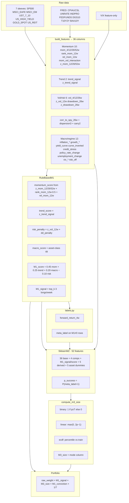

# M1 / M2 / M3 — Exact Feature Inputs & Outputs

**Research use only — not investment advice.**  
**Source of truth:** `src/feature_engineering.py`, `src/model_m1.py`, `src/model_m2.py`, `src/model_m3.py`, `src/position_sizing.py`, `src/labels.py`, `config/config.yaml`.

Interactive canvas: open `m1-m2-m3-io-diagram.canvas.tsx` beside chat.

---

## End-to-end flow (column-accurate)



---

## Config knobs (current)

| Setting | Value |
| --- | --- |
| `models.m1.weights` | momentum 0.45, trend 0.25, macro 0.20, risk_penalty 0.10 |
| `models.m1.allocation_mode` | `top_k`, `top_k: 3` |
| `models.m1.asset_class_tilts` | true |
| `models.m1.conviction_sizing` | false → `M1_conviction = \|M1_signal\|` |
| `models.m2` | logistic_regression, calibrate=true, use_meta_features=true, include_asset_encoding=true, threshold=0.55 |
| `models.m3.mode` | `linear`, threshold 0.55 |
| `labels.horizon_weeks` | 4 |

---

## Layer 0 — All 36 engineered base features

| Family | Exact columns |
| --- | --- |
| Momentum (10) | `mom_4w`, `mom_12w`, `mom_26w`, `mom_52w`, `rank_mom_12w`, `rel_mom_12w`, `mom_vol_interaction`, `z_mom_12w`, `z_mom_26w`, `z_mom_52w` |
| Trend (2) | `trend_signal`, `z_trend_signal` |
| Vol / risk (6) | `vol_4w`, `vol_12w`, `vol_26w`, `z_vol_12w`, `drawdown_26w`, `z_drawdown_26w` |
| Market link (1) | `corr_to_spy_26w` (vs SP500) |
| Dispersion (3) | `cross_asset_dispersion_4w`, `cross_asset_dispersion_12w`, `average_pairwise_correlation_26w` |
| Carry (2) | `carry_yield_level`, `credit_carry_chg` |
| Macro / regime (12) | `inflation_trend`, `inflation_up`, `growth_trend`, `growth_down`, `yield_curve`, `curve_inverted`, `credit_stress`, `policy_rate_change`, `unemployment_change`, `vix_level`, `vix_change_4w`, `risk_off` |

---

## M1 — Exact inputs scored (RuleBasedM1)

Rule-based M1 does **not** use all 36 columns. It hard-codes these:

### Momentum → `momentum_score` (weight 0.45)

| Input column | Role |
| --- | --- |
| `z_mom_12w`, `z_mom_26w`, `z_mom_52w` | mean of available |
| `rank_mom_12w` | `rank − 0.5` |
| `rel_mom_12w` | as-is |

`momentum_score = mean(available parts)`

### Trend → `trend_score` (weight 0.25)

| Input | Role |
| --- | --- |
| `z_trend_signal` | sole input |

### Risk → `risk_penalty` (weight −0.10)

| Input | Role |
| --- | --- |
| `z_vol_12w` | vol term |
| `drawdown_26w` | `dd_penalty = (−dd).clip(≥0)` |
| `z_drawdown_26w` | added if present, clip ≥0 |

`risk_penalty = z_vol_12w + dd_penalty`

### Macro → `macro_score` (weight 0.20, asset_class_tilts=true)

| Input | Used by |
| --- | --- |
| `growth_trend` | equity, reit, credit, gold |
| `risk_off` | all classes |
| `inflation_up` | all classes |
| `curve_inverted` | bond only |
| `credit_stress` | credit only |

| Asset class | Sleeves | Formula |
| --- | --- | --- |
| equity | SP500, MSCI_EAFE, MSCI_EM | `0.35·growth − 0.35·risk_off − 0.15·inflation_up` |
| reit | US_REIT | `0.25·growth − 0.30·risk_off − 0.25·inflation_up` |
| bond | UST_7_10 | `0.40·risk_off + 0.30·curve_inverted − 0.30·inflation_up` |
| credit | US_HIGH_YIELD | `0.30·growth − 0.40·credit_stress − 0.20·risk_off` |
| gold | GOLD_SPOT | `0.40·inflation_up + 0.35·risk_off − 0.15·growth` |

### M1 formula & outputs

```text
M1_score = 0.45·momentum_score + 0.25·trend_score + 0.20·macro_score − 0.10·risk_penalty
M1_signal = +1 for weekly top-3 by M1_score; else 0 (long-only)
```

**Writes:** `M1_signal`, `M1_score`, `M1_conviction`, `momentum_score`, `trend_score`, `macro_score`, `risk_penalty`

---

## Labels (M1 → M2 bridge)

| Column | Formula |
| --- | --- |
| `forward_return_4w` | `pct_change(4).shift(−4)` — never a model feature |
| `trade_return` | `M1_signal × forward_return_4w` |
| `meta_label` | if `M1≠0`: `1` iff `trade_return > 0.001`; if `M1=0`: NaN |

M2 fits only where `M1_signal ≠ 0`.

---

## M2 — Exact 52 production features

Pipeline: `SimpleImputer(median)` → `StandardScaler` → `LogisticRegression(class_weight=balanced)` → `CalibratedClassifierCV(sigmoid)`.

| Block | Count | Columns |
| ---: | ---: | --- |
| A Base engineered | 36 | all 36 from Layer 0 |
| B M1 components | 4 | `momentum_score`, `trend_score`, `macro_score`, `risk_penalty` |
| C M1 meta | 2 | `M1_signal`, `M1_score` |
| D Derived | 5 | `m1_cs_rank`, `m1_score_abs`, `m1_x_vol` (=score×z_vol_12w), `m1_x_risk_off`, `m1_x_macro` |
| E Asset dummies | 5 | `asset_class_bond`, `asset_class_credit`, `asset_class_equity`, `asset_class_gold`, `asset_class_reit` |
| **Total** | **52** | |

**Target:** `meta_label`  
**Writes:** `p_success`, `predicted_meta_label` (diagnostic `p≥0.55`; **not** used by M3)

Numbered list:

1. mom_4w 2. mom_12w 3. mom_26w 4. mom_52w 5. rank_mom_12w 6. rel_mom_12w 7. mom_vol_interaction 8. z_mom_12w 9. z_mom_26w 10. z_mom_52w  
11. trend_signal 12. z_trend_signal  
13. vol_4w 14. vol_12w 15. vol_26w 16. z_vol_12w 17. drawdown_26w 18. z_drawdown_26w  
19. corr_to_spy_26w  
20. cross_asset_dispersion_4w 21. cross_asset_dispersion_12w 22. average_pairwise_correlation_26w  
23. carry_yield_level 24. credit_carry_chg  
25. inflation_trend 26. inflation_up 27. growth_trend 28. growth_down 29. yield_curve 30. curve_inverted 31. credit_stress 32. policy_rate_change 33. unemployment_change 34. vix_level 35. vix_change_4w 36. risk_off  
37. momentum_score 38. trend_score 39. macro_score 40. risk_penalty  
41. M1_signal 42. M1_score  
43. m1_cs_rank 44. m1_score_abs 45. m1_x_vol 46. m1_x_risk_off 47. m1_x_macro  
48. asset_class_bond 49. asset_class_credit 50. asset_class_equity 51. asset_class_gold 52. asset_class_reit

---

## M3 — Exact I/O

**Inputs only:** `p_success`, `threshold` (0.55), optional `train_proba` (ECDF), `M1_signal` (for state label).

| Mode | Formula | Column |
| --- | --- | --- |
| binary | `1` if `p ≥ T` else `0` | `M3_size_binary` |
| **linear (config)** | `max(0, 2p − 1)` | `M3_size_linear` → default `M3_size` |
| ecdf | `searchsorted(train_sorted, p) / n` | `M3_size_ecdf` |

**Also writes:** `allocation_state` ∈ `{no_signal, m3_zero, m3_active}`

```text
raw_weight = M1_signal × M3_size × M1_conviction × base_budget_per_asset
```

---

## Panel read / write by stage

| Stage | Reads | Writes |
| --- | --- | --- |
| `build_features` | market, macro, VIX | 36 features + OHLCV + `return_1w` |
| labels | prices, `M1_signal` | `forward_return_4w`, `m1_target`, `trade_return`, `meta_label` |
| M1 | subset of 36 | `M1_signal`, `M1_score`, `M1_conviction`, 4 component scores |
| M2 | 36 + 4 comps + M1 cols + `meta_label` | `p_success`, `predicted_meta_label` |
| M3 | `p_success`, `M1_signal` | `M3_size_*`, `M3_size`, `allocation_state` |

---

## Key functions

| File | Functions |
| --- | --- |
| `feature_engineering.py` | `build_features`, `get_feature_columns` |
| `model_m1.py` | `_momentum_score`, `_trend_score`, `_risk_penalty`, `_asset_class_macro_tilt`, `predict_score`, `_signals_top_k` |
| `model_m2.py` | `build_m2_features`, `_build_m2_features_core`, `fit_m2`, `predict_m2` |
| `model_m3.py` | `compute_m3_size`, `attach_m3_to_panel`, `allocation_state` |
| `position_sizing.py` | `binary_size`, `linear_size`, `ecdf_size` |
| `backtest.py` | `strategy_weights_from_panel` |
