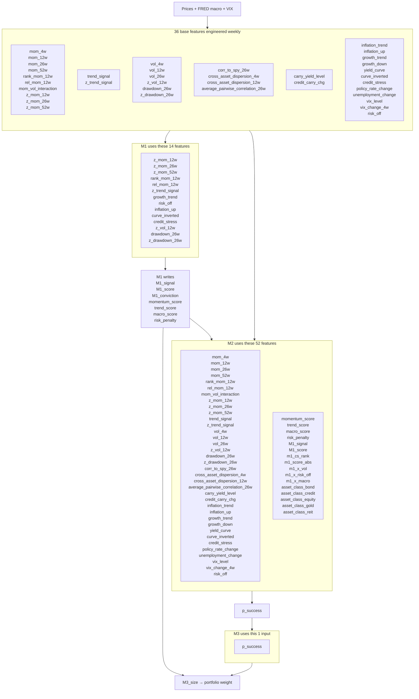

# M1 → M2 → M3: Features In Plain Language

**Research use only — not investment advice.**

| Related | |
| --- | --- |
| Code | `feature_engineering.py`, `model_m1.py`, `model_m2.py`, `model_m3.py` |
| Canvas | `m1-m2-m3-io-diagram.canvas.tsx` |

---

## Feature map (every name used by each model)

Names only in the boxes. M1 = **14** base columns. M2 = **52** columns (all 36 base + M1 extras). M3 = **`p_success`** only.



| Model | Count | What the box lists |
| --- | ---: | --- |
| **M1** | 14 | Only the base columns inside the M1 score rules |
| **M2** | 52 | All 36 base + 4 M1 components + `M1_signal`/`M1_score` + 5 derived + 5 asset-class dummies |
| **M3** | 1 | `p_success` only (no raw feature matrix) |

---

## What this file answers

| Question | Short answer |
| --- | --- |
| **Which macro variables, and how do they hit the models?** | Seven FRED series + VIX → ~12 regime/carry features → M1 uses **5** of them in class tilts; M2 uses **all** of them; M3 uses **none** (only `p_success`). |
| **Why was each feature chosen?** | See [Feature rationale](#feature-rationale-why-each-exists) — economic job + who uses it. |
| **What is not used?** | M1 ignores **22/36** base columns. M3 ignores all features. Labels are never features. Nothing in the 36 is dropped from M2 today. |
| **What could we add later?** | See [Future discoveries](#future-discoveries). |

```text
Prices + FRED macro + VIX
        →  36 weekly features
        →  M1 picks top-3 sleeves (uses 14 features)
        →  M2 P(trade works) (uses all 36 + M1 extras = 52)
        →  M3 bet size (uses only p_success)
        →  Portfolio caps
```

---

## Macro variables → model (the summary you asked for)

### Raw series we pull

| Source | Series | Economic idea | Why we chose it |
| --- | --- | --- | --- |
| FRED | `CPIAUCSL` | Inflation | Hits rates, gold, REITs, risk appetite |
| FRED | `INDPRO` | Growth / cycle | Cyclical sleeves (equity, credit, REIT) |
| FRED | `T10Y2Y` | Yield curve shape | Recession / duration regime; bonds vs risk assets |
| FRED | `BAA10Y` | Credit risk premium | Direct for HY; stress for risk assets |
| FRED | `DGS10` | Rate / carry level | Carry environment (M2 confirmation, not M1 tilt) |
| FRED | `FEDFUNDS` | Policy stance | Tightening vs easing (M2 only today) |
| FRED | `UNRATE` | Labor market | Softening cycle (M2 only today) |
| Market | `VIX` | Fear / risk-off | Fast stress signal for tilts and filters |

**Processing before models:** align to weekly Fridays (train: interpolate; test/eval: forward-fill) → lag **4 weeks** → build the derived columns below. Config: `macro.fred_series`, `features.macro_lag_weeks`, `features.align_interpolate_train`.

### How each macro implements in the models

| Derived feature(s) | From | M1 (20% of score) | M2 | M3 |
| --- | --- | :---: | :---: | :---: |
| `inflation_up` (and `inflation_trend`) | CPI | Yes — class tilt | Yes | No |
| `growth_trend` (and `growth_down`) | INDPRO | Yes — `growth_trend` only | Yes | No |
| `curve_inverted` (and `yield_curve`) | T10Y2Y | Yes — `curve_inverted` for bonds | Yes | No |
| `credit_stress`, `credit_carry_chg` | BAA10Y | Yes — `credit_stress` for HY | Yes | No |
| `carry_yield_level` | DGS10 | No | Yes | No |
| `policy_rate_change` | FEDFUNDS | No | Yes | No |
| `unemployment_change` | UNRATE | No | Yes | No |
| `risk_off`, `vix_level`, `vix_change_4w` | VIX | Yes — `risk_off` only | Yes | No |

**M1 implementation (fixed recipe, not learned):** each asset class gets a different tilt from the same macro flags, then that tilt is **20%** of `M1_score`:

```text
equity:  +growth  −risk_off  −inflation_up
reit:    +growth  −risk_off  −inflation_up (stronger inflation penalty)
bond:    +risk_off  +curve_inverted  −inflation_up
credit:  +growth  −credit_stress  −risk_off
gold:    +inflation_up  +risk_off  −growth
```

**M2 implementation (learned):** all macro/regime columns enter the logistic as covariates, plus `macro_score` and `m1_x_macro` / `m1_x_risk_off`, so M2 can reweight or override M1’s fixed recipe when predicting trade success.

**M3 implementation:** none of the macro columns. Size = f(`p_success`) only.

---

## Pipeline in brief

| Stage | Inputs | Output | Knob |
| --- | --- | --- | --- |
| Features | Prices, FRED, VIX | 36 columns | windows, macro lag |
| **M1** | **14** of 36 | `M1_signal`, `M1_score`, 4 components | 45/25/20/10; top-3 |
| Labels | Signal + future return | `meta_label` | 4-week horizon |
| **M2** | 36 + M1 extras = **52** | `p_success` | calibrated logistic |
| **M3** | `p_success` only | `M3_size` | linear: max(0, 2p−1) |
| Portfolio | signal × size | weight | 25% sleeve / 100% gross / 12% vol |

```text
M1_score = 0.45·momentum + 0.25·trend + 0.20·macro − 0.10·risk
M1_signal = +1 for top 3 sleeves (long-only); else 0
raw_weight = M1_signal × M3_size × M1_conviction × (1/7)
```

---

## Feature rationale (why each exists)

Plain “why chosen” + who uses it. **M1** = selection score. **M2** = success probability. **M3** = never these columns.

### Price / technical (built from sleeve prices)

| Feature | Why chosen | M1 | M2 |
| --- | --- | :---: | :---: |
| `mom_4w` | Short rebound / noise horizon | | ✓ |
| `mom_12w` | Core quarter momentum | | ✓ |
| `mom_26w` / `mom_52w` | Half-year / year trend persistence | | ✓ |
| `z_mom_12w` / `z_mom_26w` / `z_mom_52w` | Same moms, cross-section comparable across sleeves | ✓ | ✓ |
| `rank_mom_12w` | “Strong vs peers this week” | ✓ | ✓ |
| `rel_mom_12w` | Beats equal-weight basket | ✓ | ✓ |
| `mom_vol_interaction` | Prefer momentum that is not extremely noisy | | ✓ |
| `trend_signal` | MA10 vs MA40 — simple up/down trend | | ✓ |
| `z_trend_signal` | Trend vs peers → M1 trend leg (25%) | ✓ | ✓ |
| `vol_4w` / `vol_12w` / `vol_26w` | Risk level at several horizons | | ✓ |
| `z_vol_12w` | Relative risk vs peers → M1 risk leg | ✓ | ✓ |
| `drawdown_26w` / `z_drawdown_26w` | Avoid sleeves already deep underwater | ✓ | ✓ |
| `corr_to_spy_26w` | Equity beta / diversifier signal | | ✓ |
| `cross_asset_dispersion_*` | Universe stress / scatter | | ✓ |
| `average_pairwise_correlation_26w` | Everything moving together → hard to diversify | | ✓ |

### Carry + macro / regime (from FRED + VIX)

| Feature | Why chosen | M1 | M2 |
| --- | --- | :---: | :---: |
| `carry_yield_level` | Rate level / carry backdrop | | ✓ |
| `credit_carry_chg` | Credit conditions changing now | | ✓ |
| `inflation_trend` | Continuous inflation pressure | | ✓ |
| `inflation_up` | Simple “hot inflation” regime flag for tilts | ✓ | ✓ |
| `growth_trend` | Cycle strength for cyclicals | ✓ | ✓ |
| `growth_down` | Soft-growth flag | | ✓ |
| `yield_curve` | Continuous curve shape | | ✓ |
| `curve_inverted` | Binary recession / duration cue (bonds) | ✓ | ✓ |
| `credit_stress` | HY and risk-asset stress | ✓ | ✓ |
| `policy_rate_change` | Recent Fed tightening/easing | | ✓ |
| `unemployment_change` | Labor soft patch | | ✓ |
| `vix_level` / `vix_change_4w` | Fear level and spikes | | ✓ |
| `risk_off` | High-VIX regime flag for class tilts | ✓ | ✓ |

### M1 outputs that M2 reads again

| Feature | Why M2 sees it again |
| --- | --- |
| `momentum_score`, `trend_score`, `macro_score`, `risk_penalty` | How M1 decomposed the call |
| `M1_score`, `M1_signal` | Overall pick strength and side |
| `m1_cs_rank`, `m1_score_abs` | Relative / absolute conviction |
| `m1_x_vol`, `m1_x_risk_off`, `m1_x_macro` | “Does this M1 call work in this regime?” |
| `asset_class_*` dummies | Different base success odds by sleeve type |

**Why overlap M1 and M2 on the same raw macros?** M1 = transparent **who to trade** with fixed economics. M2 = learned **will it work?** Same context, different job. M2 can correct M1’s fixed weights and needs both `M1_score` and regimes for interactions. Caveat: collinearity (e.g. `growth_trend` and `macro_score`).

---

## What is not used (or barely used)

### Unused by M1 (22 of 36) — still used by M2

`mom_4w`, `mom_12w`, `mom_26w`, `mom_52w`, `mom_vol_interaction`, `trend_signal`, `vol_4w`, `vol_12w`, `vol_26w`, `corr_to_spy_26w`, `cross_asset_dispersion_4w`, `cross_asset_dispersion_12w`, `average_pairwise_correlation_26w`, `carry_yield_level`, `credit_carry_chg`, `inflation_trend`, `growth_down`, `yield_curve`, `policy_rate_change`, `unemployment_change`, `vix_level`, `vix_change_4w`

M1 deliberately stays small (momentum / trend / 5 macro flags / risk) so the selector stays auditable.

### Unused by M3

All 36 features and all M1 extras. M3 only sees `p_success`.

### Never used as model inputs (labels / diagnostics)

| Column | Role |
| --- | --- |
| `forward_return_4w`, `trade_return`, `meta_label`, `m1_target` | Labels / grading only |
| `predicted_meta_label` | Diagnostic hard cut at 0.55; **not** what M3 sizes on |
| OHLC, `volume`, `return_1w`, `adj_close` | Data plumbing, not M1/M2 features |

### Built but soft / off

| Item | Status |
| --- | --- |
| `M1_conviction` | Written; conviction sizing **off** → effectively 0/1 with the signal |
| Short side | Disabled in production long-only |

**There is no engineered feature among the 36 that is dropped from M2 today.** “Unused” means unused by M1 or M3, not deleted from the panel.

---

## Future discoveries

### New data / features worth exploring

| Idea | Why it might help |
| --- | --- |
| Real yield / breakeven inflation | Cleaner rate + inflation split for gold/bonds |
| USD index (DXY) | EM, gold, international equities |
| Oil / commodity impulse | Inflation and risk sentiment |
| PMI / ISM (or similar) | Faster cycle than industrial production |
| Equity breadth / credit OAS alternatives | Confirm risk-on without only VIX |
| Term premium / move index | Bond-specific risk |
| Cross-asset momentum of VIX or HY spreads | Stress momentum, not just level |
| Earnings / valuation proxies (careful with lag) | Equity sleeve confirmation for M2 |

### Modeling cleanups (same data, smarter use)

| Idea | Why |
| --- | --- |
| Ablate M1’s 14 raw inputs out of M2 | Test if reuse helps or only duplicates `macro_score` / `momentum_score` |
| Put Fed/UNRATE/DGS10 into optional M1 tilts | Today they only help M2 |
| L1 / feature selection on M2 | 52 columns vs sparse trade weeks |
| Optional M3 dampener from vol / `risk_off` | Size reacts to stress, not only `p_success` |
| Config lists: `m1_features` vs `m2_extra_features` | Make selection vs confirmation explicit |

**First research bet:** remove shared raw columns from M2; keep M1 meta + M2-only base; judge on walk-forward AUC / portfolio IR.

---

## Cheat sheet

| Stage | Reads | Writes |
| --- | --- | --- |
| Features | Prices, FRED, VIX | 36 features |
| M1 | 14 features | signal, score, 4 components |
| Labels | signal + future prices | `meta_label`, … |
| M2 | 52 features + `meta_label` | `p_success` |
| M3 | `p_success` | `M3_size` |

### Full M2 list (1–52)

1–10 mom family · 11–12 trend · 13–18 vol/dd · 19 corr · 20–22 dispersion · 23–24 carry · 25–36 macro/VIX · 37–40 M1 components · 41–42 `M1_signal`/`M1_score` · 43–47 derived interactions · 48–52 asset-class dummies  

Exact names: `mom_4w`, `mom_12w`, `mom_26w`, `mom_52w`, `rank_mom_12w`, `rel_mom_12w`, `mom_vol_interaction`, `z_mom_12w`, `z_mom_26w`, `z_mom_52w`, `trend_signal`, `z_trend_signal`, `vol_4w`, `vol_12w`, `vol_26w`, `z_vol_12w`, `drawdown_26w`, `z_drawdown_26w`, `corr_to_spy_26w`, `cross_asset_dispersion_4w`, `cross_asset_dispersion_12w`, `average_pairwise_correlation_26w`, `carry_yield_level`, `credit_carry_chg`, `inflation_trend`, `inflation_up`, `growth_trend`, `growth_down`, `yield_curve`, `curve_inverted`, `credit_stress`, `policy_rate_change`, `unemployment_change`, `vix_level`, `vix_change_4w`, `risk_off`, `momentum_score`, `trend_score`, `macro_score`, `risk_penalty`, `M1_signal`, `M1_score`, `m1_cs_rank`, `m1_score_abs`, `m1_x_vol`, `m1_x_risk_off`, `m1_x_macro`, `asset_class_bond`, `asset_class_credit`, `asset_class_equity`, `asset_class_gold`, `asset_class_reit`.
