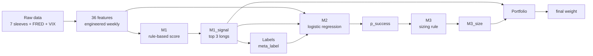

# M1 → M2 → M3: What Goes In, What Comes Out

**Research use only — not investment advice.**

A plain-language map of the pipeline. Technical column names are kept exact so you can match code and reports.

| Document | Role |
| --- | --- |
| This file | Human-readable I/O + feature glossary |
| Interactive canvas | `m1-m2-m3-io-diagram.canvas.tsx` (open beside chat) |
| Code | `feature_engineering.py`, `model_m1.py`, `model_m2.py`, `model_m3.py` |

---

## One-sentence overview

**M1** picks which sleeves to trade · **M2** estimates how likely that trade is to work · **M3** turns that probability into a bet size · **Portfolio** applies risk caps.

```text
Prices + macro + VIX
        ↓
   36 engineered features
        ↓
   M1  →  M1_signal (+ scores)
        ↓
   Labels (did the trade work?)
        ↓
   M2  →  p_success   (52 features)
        ↓
   M3  →  M3_size
        ↓
   Portfolio weight
```

---

## Picture of the flow



---

## Who uses which features?

| Stage | How many inputs? | What it decides | Main output |
| --- | ---: | --- | --- |
| Feature engineering | Market + macro series | Builds numbers for models | **36** named columns |
| **M1** | **13** of those 36 (hard-coded) | Which sleeves to long this week | `M1_signal`, `M1_score`, 4 component scores |
| Labels | M1 signal + future return | Was the trade profitable? | `meta_label` (train target for M2) |
| **M2** | **52** columns (36 + M1 extras) | P(trade succeeds) | `p_success` |
| **M3** | **1** number: `p_success` | How large a bet | `M3_size` (0–1) |

Important: M1 does **not** use all 36 features. M3 does **not** use a feature matrix at all—only the probability from M2.

See [Shared features between M1 and M2](#shared-features-between-m1-and-m2) for which columns appear in both models, why that reuse is intentional, and where to improve next.

---

## Current settings (config)

| Knob | Value | Plain meaning |
| --- | --- | --- |
| M1 weights | 45% / 25% / 20% / 10% | Momentum / trend / macro / risk |
| M1 allocation | top 3 per week | Rank all 7 sleeves; long the best three |
| M2 model | Calibrated logistic regression | Probability of a good trade |
| M2 threshold | 0.55 | Used for diagnostic binary label only |
| M3 mode | **linear** | Size = max(0, 2×p − 1) |
| Horizon | 4 weeks | Label looks 4 weeks ahead |

---

## Step 1 — The 36 base features (families)

These are built every week for each sleeve. Full descriptions are in the [glossary](#feature-glossary-extended-descriptions) at the bottom.

| Family | Count | Column names |
| --- | ---: | --- |
| Momentum | 10 | `mom_4w` `mom_12w` `mom_26w` `mom_52w` `rank_mom_12w` `rel_mom_12w` `mom_vol_interaction` `z_mom_12w` `z_mom_26w` `z_mom_52w` |
| Trend | 2 | `trend_signal` `z_trend_signal` |
| Volatility / risk | 6 | `vol_4w` `vol_12w` `vol_26w` `z_vol_12w` `drawdown_26w` `z_drawdown_26w` |
| Link to U.S. equity | 1 | `corr_to_spy_26w` |
| Cross-asset stress | 3 | `cross_asset_dispersion_4w` `cross_asset_dispersion_12w` `average_pairwise_correlation_26w` |
| Carry | 2 | `carry_yield_level` `credit_carry_chg` |
| Macro / regime | 12 | `inflation_trend` `inflation_up` `growth_trend` `growth_down` `yield_curve` `curve_inverted` `credit_stress` `policy_rate_change` `unemployment_change` `vix_level` `vix_change_4w` `risk_off` |

---

## Step 2 — M1: what it reads and writes

### M1 reads (13 columns → 4 component scores)

| Component | Weight in `M1_score` | Inputs used |
| --- | ---: | --- |
| **Momentum** | +45% | `z_mom_12w`, `z_mom_26w`, `z_mom_52w`, `rank_mom_12w`, `rel_mom_12w` |
| **Trend** | +25% | `z_trend_signal` |
| **Macro tilt** | +20% | `growth_trend`, `risk_off`, `inflation_up`, `curve_inverted`, `credit_stress` |
| **Risk penalty** | −10% | `z_vol_12w`, `drawdown_26w`, `z_drawdown_26w` |

How the components are built:

- **momentum_score** = average of (mean of available z-momentums, rank−0.5, relative momentum)
- **trend_score** = `z_trend_signal`
- **risk_penalty** = `z_vol_12w` + drawdown penalty (how far below a recent peak)
- **macro_score** = class-specific tilt (see table below)

### Macro tilt by asset class

| Class | Sleeves | What the tilt favors |
| --- | --- | --- |
| Equity | SP500, MSCI_EAFE, MSCI_EM | Growth up, risk-off down, inflation-up down |
| REIT | US_REIT | Similar to equity, more inflation penalty |
| Bond | UST_7_10 | Risk-off up, inverted curve up, inflation-up down |
| Credit | US_HIGH_YIELD | Growth up, credit stress down, risk-off down |
| Gold | GOLD_SPOT | Inflation-up up, risk-off up, growth down |

Exact formulas:

```text
equity:  0.35·growth − 0.35·risk_off − 0.15·inflation_up
reit:    0.25·growth − 0.30·risk_off − 0.25·inflation_up
bond:    0.40·risk_off + 0.30·curve_inverted − 0.30·inflation_up
credit:  0.30·growth − 0.40·credit_stress − 0.20·risk_off
gold:    0.40·inflation_up + 0.35·risk_off − 0.15·growth
```

### M1 composite and signal

```text
M1_score   = 0.45·momentum + 0.25·trend + 0.20·macro − 0.10·risk
M1_signal  = +1 for the top 3 sleeves this week (long-only); else 0
M1_conviction = 0 or 1  (conviction sizing is off)
```

**M1 writes to the panel:** `M1_signal`, `M1_score`, `M1_conviction`, `momentum_score`, `trend_score`, `macro_score`, `risk_penalty`

---

## Step 3 — Labels (bridge to M2)

| Column | Plain meaning |
| --- | --- |
| `forward_return_4w` | How much the sleeve returned over the *next* 4 weeks (label only—never a feature) |
| `trade_return` | That return, signed by M1’s direction |
| `meta_label` | 1 if the M1 trade cleared a small profit bar (~0.1% after cost); else 0. Blank when M1 was flat |

M2 only trains on weeks where M1 actually proposed a trade (`M1_signal ≠ 0`).

---

## Step 4 — M2: 52 features → probability

**Model:** median impute → standardize → logistic regression → probability calibration.

| Block | Count | What it adds |
| ---: | ---: | --- |
| A | 36 | All engineered base features |
| B | 4 | M1’s own component scores |
| C | 2 | `M1_signal`, `M1_score` |
| D | 5 | Derived: CS rank, abs score, score×vol, score×risk_off, score×macro |
| E | 5 | Asset-class dummy flags (bond / credit / equity / gold / reit) |
| **Total** | **52** | |

**Target:** `meta_label`  
**Main output:** `p_success` = estimated P(trade succeeds)  
**Side output:** `predicted_meta_label` = 1 if `p_success ≥ 0.55` (diagnostic; M3 does **not** use this)

Derived M2 columns:

| Column | Meaning |
| --- | --- |
| `m1_cs_rank` | Where this sleeve’s M1 score ranks among the 7 this week (0–1) |
| `m1_score_abs` | Absolute strength of M1 score |
| `m1_x_vol` | M1 score × relative volatility |
| `m1_x_risk_off` | M1 score × risk-off flag |
| `m1_x_macro` | M1 score × macro component |

---

## Shared features between M1 and M2

M1 and M2 both see overlapping market/macro columns. That is **by design** (hierarchical meta-labeling), not an accident. Same inputs, different jobs.

### What overlaps

**13 raw engineered columns** are hard-coded into M1’s four components. Those same 13 are also inside M2’s block of **36** base features.

| Shared column | M1 role | Also in M2 as… |
| --- | --- | --- |
| `z_mom_12w`, `z_mom_26w`, `z_mom_52w` | Averaged into **momentum_score** (45% of `M1_score`) | Raw covariates in the logistic |
| `rank_mom_12w`, `rel_mom_12w` | Part of momentum blend | Raw covariates |
| `z_trend_signal` | Equals **trend_score** (25%) | Raw covariate |
| `growth_trend`, `risk_off`, `inflation_up`, `curve_inverted`, `credit_stress` | Handcrafted **macro_score** tilt by asset class (20%) | Raw covariates |
| `z_vol_12w`, `drawdown_26w`, `z_drawdown_26w` | Build **risk_penalty** (−10%) | Raw covariates; `z_vol_12w` also enters `m1_x_vol` |

On top of that, M2 **re-reads M1’s outputs** (not raw inputs):

| M1 write | How M2 uses it |
| --- | --- |
| `momentum_score`, `trend_score`, `macro_score`, `risk_penalty` | Direct features (how M1 decomposed the call) |
| `M1_score`, `M1_signal` | Overall attractiveness and signed side |
| Derived `m1_cs_rank`, `m1_score_abs`, `m1_x_vol`, `m1_x_risk_off`, `m1_x_macro` | Cross-sectional rank, conviction proxy, and score×context interactions |

**23 of 36** base features are **M2-only** (M1 never scores them): e.g. `mom_4w`, raw `mom_*`, `mom_vol_interaction`, most `vol_*`, `corr_to_spy_26w`, dispersion / pairwise correlation, carry (`carry_yield_level`, `credit_carry_chg`), and several regime series (`inflation_trend`, `yield_curve`, `vix_level`, `vix_change_4w`, unemployment/policy changes, etc.). Those give M2 confirmation context without changing who M1 ranks.

```text
36 base features
 ├── 13 → M1 rules (fixed weights / class tilts) ─┐
 │                                                 ├→ M1_score / signal / components
 └── 36 → M2 logistic (learned weights)  ←─────────┘  + interactions + 5 asset dummies
```

### How the same feature is used differently

| Dimension | M1 | M2 |
| --- | --- | --- |
| Job | **Select** sleeves (top-3 long) | **Filter / size confidence** for sleeves M1 already picked |
| Functional form | Fixed formulas and weights | Learned linear log-odds (+ calibration) |
| Target | Implicit economic prior (momentum/trend/macro/risk) | Explicit `meta_label` (did the M1 trade clear the profit bar?) |
| Macro | Asset-class **recipe** (e.g. bonds like risk-off; gold likes inflation-up) | Can reweight or contradict that recipe if history says so |
| Risk | Always subtracts vol/drawdown from attractiveness | Can learn “high vol + strong M1 score” fails more often via `m1_x_vol` |
| Universe | Scores all 7 sleeves every week | Trains/predicts only where `M1_signal ≠ 0` |

### Why reuse (rationale)

1. **Separation of concerns** — M1 stays a transparent primary model reviewers can audit. M2 is a second opinion on trade *success*, not a second ranking engine.
2. **Corrective flexibility** — If M1’s fixed 45% momentum weight is too aggressive in some regimes, M2 can down-weight success odds when the same momentum features look bad historically for meta-labels.
3. **Interactions need both layers** — Columns like `m1_x_risk_off` only make sense if M2 sees both the proposal (`M1_score`) and the regime (`risk_off`) that already influenced M1.
4. **Extra features without rewriting M1** — Carry, short-horizon mom, VIX level, dispersion, etc. inform “will this work?” without diluting M1’s simple score card.
5. **Classic meta-labeling pattern** — Primary signal + secondary model conditioned on that signal (López de Prado–style hierarchy): overlapping context is expected; the *label* and *decision* differ.

**Caveat:** Overlap creates collinearity (`growth_trend` plus `macro_score` that embeds `growth_trend`; `z_mom_*` plus `momentum_score`). Logistic regression can still fit, but coefficients on shared raw columns are harder to interpret and can overfit when meta-label samples are sparse.

---

## Room for future improvements

| Idea | Why it helps | Practical next step |
| --- | --- | --- |
| **Drop redundant raw inputs from M2** | If M2 already has `momentum_score` / `macro_score`, raw `z_mom_*` / `growth_trend` may add noise | Ablation: “M1-meta + M2-only base” vs full 52; keep OOS AUC / portfolio IR |
| **Orthogonalize shared blocks** | Feed residuals of base features after regressing out M1 components | Research variant in `m2_feature_enrichment.py` |
| **Shrinkage / selection** | 52 columns vs limited traded weeks → variance | L1 logistic, stability selection, or mutual-information screen on train only |
| **Config split: selection vs confirmation** | Make overlap explicit and tunable | YAML lists `m1_features` vs `m2_extra_features`; document in this file |
| **Leaner M1 → richer M2** | Put short mom / carry / dispersion only in M2 (already partly true); avoid expanding M1 without IR proof | Gate new M1 inputs via walk-forward factor research |
| **Richer M2 without double-counting** | Prefer interactions (`m1_x_*`) and asset dummies over cloning every M1 input | Extend enrichment variants; adopt only if walk-forward wins |
| **Per-sleeve or hierarchical M2** | Same feature means different success odds for GOLD vs SP500 | Already explored in code paths; validate before production |
| **M3 context (optional)** | Size today ignores vol/regime once `p_success` is set | Optional size dampener from `z_vol_12w` / `risk_off` with hard risk caps unchanged |
| **Interpretability report** | Show which shared features drive M2 after controlling for M1 score | Partial dependence / coefficient tables in `m2_diagnostics` |
| **Collinearity monitor** | Flag VIF or correlation of M2 columns vs M1 components each run | Add to validation JSON; warn if train condition number spikes |

Priority for research: first ablate **shared raw features out of M2** while keeping M1 meta + M2-only base; that tests whether reuse is earning its keep or mostly duplicating M1.

---

## Step 5 — M3: probability → bet size

M3 is a **rule**, not a second classifier. It only looks at `p_success`.

| Mode | Rule | When used |
| --- | --- | --- |
| Binary | Full size if `p ≥ 0.55`, else zero | Research / comparison |
| **Linear** | `max(0, 2p − 1)` | **Production default** |
| ECDF | Percentile of `p` vs training `p`’s | Strong risk-shaping variant |

Also labels each asset-week:

| State | Meaning |
| --- | --- |
| `no_signal` | M1 did not pick this sleeve |
| `m3_zero` | M1 picked it, but M3 size is 0 |
| `m3_active` | M1 picked it and M3 size &gt; 0 |

```text
raw_weight = M1_signal × M3_size × M1_conviction × (1/7)
```

Then portfolio caps (25% per sleeve, 100% gross) and 12% vol targeting.

---

## Cheat sheet — panel columns by stage

| Stage | Reads | Writes |
| --- | --- | --- |
| Features | Prices, FRED, VIX | 36 feature columns |
| M1 | 13 of those features | Signal, score, conviction, 4 components |
| Labels | Signal + future prices | `forward_return_4w`, `meta_label`, … |
| M2 | 52-feature matrix + `meta_label` | `p_success` |
| M3 | `p_success` (+ train probs for ECDF) | `M3_size`, allocation state |

---

# Feature glossary — extended descriptions

Every column the pipeline may write for modeling. Descriptions match the formulas in `feature_engineering.py` / `model_m1.py` / `model_m2.py`.

Unless noted, features are known **at decision time** (shifted so they do not peek at the week being traded).

---

## A. Momentum family

### `mom_4w`
Return of the sleeve over the past **4 weeks**. Short-term price change. Positive = recently up.

### `mom_12w`
Return over the past **12 weeks** (~1 quarter). Core medium-term momentum signal.

### `mom_26w`
Return over the past **26 weeks** (~half year). Medium/long momentum.

### `mom_52w`
Return over the past **52 weeks** (~1 year). Long-horizon momentum.

### `rank_mom_12w`
Cross-sectional **percentile rank** of 12-week momentum among the 7 sleeves this week (0 = weakest, 1 = strongest). Answers “is this sleeve strong *relative to peers*?”

### `rel_mom_12w`
12-week momentum **minus** the equal-weight average momentum of all sleeves. Positive = beating the basket; negative = lagging.

### `mom_vol_interaction`
12-week momentum scaled by inverse volatility (`mom_12w × clip(1/vol_12w)`). Favors momentum that is not coming with extreme noisiness.

### `z_mom_12w` / `z_mom_26w` / `z_mom_52w`
Cross-sectional **z-scores** of the corresponding momentum: how many standard deviations above/below the weekly cross-section mean. Makes “strong” comparable across sleeves with different typical return scales.

---

## B. Trend family

### `trend_signal`
`(MA_10 / MA_40 − 1)`: short moving average vs long moving average of price. Positive = short MA above long MA (uptrend); negative = downtrend.

### `z_trend_signal`
Cross-sectional z-score of `trend_signal` across sleeves that week. Used directly as M1’s **trend_score**.

---

## C. Volatility and drawdown family

### `vol_4w` / `vol_12w` / `vol_26w`
Annualized weekly volatility over the last 4 / 12 / 26 weeks (`std × √52`). Higher = choppier price path.

### `z_vol_12w`
Cross-sectional z-score of 12-week vol. High means this sleeve is *relatively* volatile vs peers. Feeds M1’s risk penalty and M2’s `m1_x_vol`.

### `drawdown_26w`
How far current price is below the **peak of the last 26 weeks** (negative or zero). More negative = deeper recent drawdown.

### `z_drawdown_26w`
Cross-sectional z-score of that drawdown. Used to strengthen the risk penalty when a sleeve is unusually deep underwater vs peers.

---

## D. Market-link and cross-asset family

### `corr_to_spy_26w`
Rolling 26-week correlation of this sleeve’s returns with **SP500**. Near 1 = moves with U.S. equities; near 0 or negative = diversifier.

### `cross_asset_dispersion_4w` / `cross_asset_dispersion_12w`
Average across sleeves of recent return volatility (4- or 12-week). High = the universe is scattered / stressed; low = calm, similar moves. Same value broadcast to every sleeve that week.

### `average_pairwise_correlation_26w`
Average pairwise correlation among all sleeves over 26 weeks. High = everything moves together (harder to diversify); low = more independent sleeves.

---

## E. Carry family

### `carry_yield_level`
Level of the **10-year Treasury yield** (FRED `DGS10`), macro-lagged. Proxy for rate / carry environment.

### `credit_carry_chg`
4-week **change** in the BAA credit spread over Treasuries (`BAA10Y`). Rising = credit stress increasing; falling = easing.

---

## F. Macro and regime family

Sparse / multi-frequency FRED releases are aligned onto the weekly market Friday calendar first: **train** uses time interpolation between known observations then forward-fill; **test/eval** uses forward-fill only (last known value until the next release). Series are then lagged by **4 weeks** to reduce publication look-ahead (`features.align_interpolate_train`, `features.macro_lag_weeks`).

### `inflation_trend`
Year-over-year % change in CPI (`CPIAUCSL`). Positive and rising = hotter inflation.

### `inflation_up`
Flag = 1 when `inflation_trend` is **above** its ~3-year rolling median. “Inflation is elevated vs recent history.”

### `growth_trend`
Year-over-year % change in industrial production (`INDPRO`). Proxy for economic growth.

### `growth_down`
Flag = 1 when `growth_trend` is **below** its ~3-year rolling median. Soft/weak growth regime.

### `yield_curve`
10y−2y Treasury spread (`T10Y2Y`). Positive = normal upward curve; negative = inverted.

### `curve_inverted`
Flag = 1 when `T10Y2Y < 0`. Classic recession-risk / risk-off for cyclicals; can favor bonds in M1’s tilt.

### `credit_stress`
Level of BAA yield spread over Treasuries (`BAA10Y`). Higher = markets demand more credit risk premium.

### `policy_rate_change`
4-week change in the Fed funds rate (`FEDFUNDS`). Positive = policy tightening recently.

### `unemployment_change`
12-week change in unemployment rate (`UNRATE`). Rising unemployment = labor market softening.

### `vix_level`
VIX level (lagged one week). “Fear gauge” for equity markets.

### `vix_change_4w`
4-week % change in VIX. Spike = sudden jump in fear.

### `risk_off`
Flag = 1 when VIX is above its ~3-year 75th percentile. Stress / risk-off regime used heavily in M1 macro tilts and M2 interactions.

---

## G. M1 outputs (also inputs to M2)

### `momentum_score`
M1’s blended momentum component (z-moms + relative rank + relative mom). Higher = stronger momentum story.

### `trend_score`
M1’s trend component (= `z_trend_signal`). Higher = stronger uptrend vs peers.

### `macro_score`
M1’s asset-class macro tilt for this sleeve. Sign and size depend on class (see table above).

### `risk_penalty`
M1’s risk component (vol + drawdown). Higher = more dangerous; **subtracted** from the composite score.

### `M1_score`
Weighted blend: `0.45·mom + 0.25·trend + 0.20·macro − 0.10·risk`. Continuous attractiveness score.

### `M1_signal`
Discrete trade direction: **+1** long candidate, **−1** short (if enabled), **0** flat. Production long-only: top 3 sleeves get +1.

### `M1_conviction`
With conviction sizing off: 1 when there is a non-zero signal, else 0. Multiplies position size later.

---

## H. Label columns (never used as M2 features)

### `forward_return_4w`
Realized return over the **next** 4 weeks. Used only to grade trades after the fact.

### `m1_target`
Coarse direction label for M1 diagnostics: +1 / −1 / 0 from forward return vs ±0.5% thresholds.

### `trade_return`
`M1_signal × forward_return_4w` — P&amp;L of following M1’s side.

### `meta_label`
1 if that trade cleared the cost-aware profit bar; 0 if not; missing if M1 was flat. **This is M2’s training target.**

---

## I. M2-only derived features

### `m1_cs_rank`
Percentile rank of `M1_score` among sleeves on that date. “How strong was M1’s pick *relative to other picks this week*?”

### `m1_score_abs`
Absolute value of `M1_score`. Captures conviction strength regardless of sign.

### `m1_x_vol`
`M1_score × z_vol_12w`. Interaction: does M1’s view coincide with unusual volatility?

### `m1_x_risk_off`
`M1_score × risk_off`. Interaction: how does M1’s view behave in stress weeks?

### `m1_x_macro`
`M1_score × macro_score`. Interaction between overall score and the macro tilt component.

### `asset_class_bond` / `asset_class_credit` / `asset_class_equity` / `asset_class_gold` / `asset_class_reit`
One-hot flags for the sleeve’s asset class. Let M2 learn different base odds by class (e.g. bonds vs equities).

---

## J. M2 / M3 / portfolio outputs

### `p_success`
M2’s calibrated probability that the M1 trade is a “success” under `meta_label`. Main handoff to M3. Range roughly 0–1.

### `predicted_meta_label`
Hard 0/1 if `p_success ≥ 0.55`. Diagnostic only—**not** what M3 sizes on.

### `M3_size_binary` / `M3_size_linear` / `M3_size_ecdf`
Bet fractions under each sizing rule (see Step 5).

### `M3_size`
The active sizing column from config (`linear` by default).

### `allocation_state`
`no_signal` | `m3_zero` | `m3_active` — audit label for whether capital was proposed and sized.

### `raw_weight` / `weight`
Signed portfolio weight before/after constraints and vol targeting.

---

## Quick reference — full M2 feature list (1–52)

1. `mom_4w` · 2. `mom_12w` · 3. `mom_26w` · 4. `mom_52w` · 5. `rank_mom_12w` · 6. `rel_mom_12w` · 7. `mom_vol_interaction` · 8. `z_mom_12w` · 9. `z_mom_26w` · 10. `z_mom_52w`  
11. `trend_signal` · 12. `z_trend_signal`  
13. `vol_4w` · 14. `vol_12w` · 15. `vol_26w` · 16. `z_vol_12w` · 17. `drawdown_26w` · 18. `z_drawdown_26w`  
19. `corr_to_spy_26w`  
20. `cross_asset_dispersion_4w` · 21. `cross_asset_dispersion_12w` · 22. `average_pairwise_correlation_26w`  
23. `carry_yield_level` · 24. `credit_carry_chg`  
25. `inflation_trend` · 26. `inflation_up` · 27. `growth_trend` · 28. `growth_down` · 29. `yield_curve` · 30. `curve_inverted` · 31. `credit_stress` · 32. `policy_rate_change` · 33. `unemployment_change` · 34. `vix_level` · 35. `vix_change_4w` · 36. `risk_off`  
37. `momentum_score` · 38. `trend_score` · 39. `macro_score` · 40. `risk_penalty`  
41. `M1_signal` · 42. `M1_score`  
43. `m1_cs_rank` · 44. `m1_score_abs` · 45. `m1_x_vol` · 46. `m1_x_risk_off` · 47. `m1_x_macro`  
48. `asset_class_bond` · 49. `asset_class_credit` · 50. `asset_class_equity` · 51. `asset_class_gold` · 52. `asset_class_reit`
