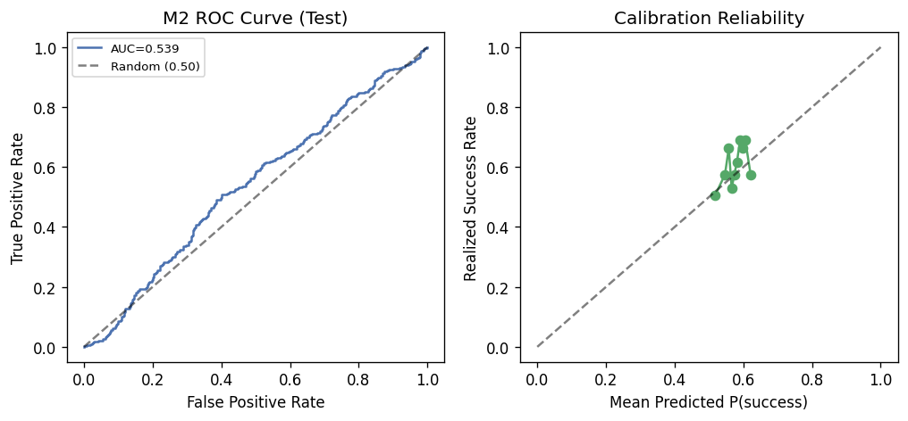
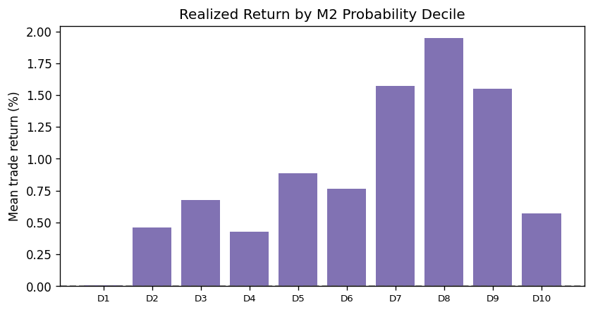
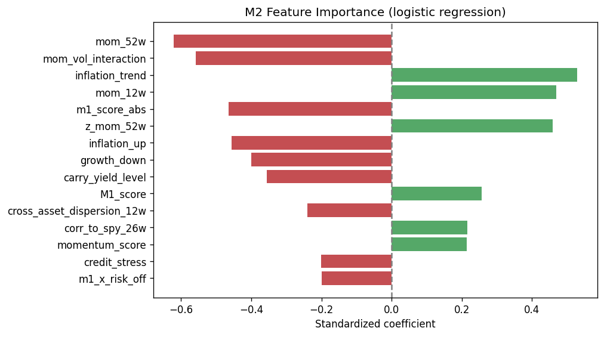

# M2 Diagnostics & AUC-ROC Guide

**Research use only — not investment advice.**

## Classifier Metrics (Test Set)

| Metric | Value | Meaning |
| --- | --- | --- |
| Accuracy | 0.5928 | Share of correct meta-label predictions |
| Precision | 0.6215 | Approved trades that were actually profitable |
| Recall | 0.8444 | Profitable trades that M2 approved |
| F1 Score | 0.7160 | Balance of precision and recall |
| AUC-ROC | 0.5389 | Ranking quality: P(random winner scored higher than random loser) |
| AUC-PR | 0.6203 | Precision-recall AUC; more informative when base rate ≠ 50% |
| Base Rate | 60.7843% | Fraction of M1 trades that beat the cost hurdle |
| Brier Score | 0.2387 | Probability calibration error (lower is better) |
| Mean P (winners) | 0.5770 | Average M2 probability on profitable trades |
| Mean P (losers) | 0.5738 | Average M2 probability on unprofitable trades |
| Mean IC | 0.0972 | Spearman rank correlation of M1 scores vs forward returns |

## Understanding AUC-ROC

AUC-ROC measures **ranking quality**, not accuracy. If you randomly pick one winning trade and one losing trade, AUC is the probability M2 assigns a higher `P(success)` to the winner. At **0.5389**, discrimination is only slightly above random (0.50).

| AUC | Interpretation |
| --- | --- |
| 0.50 | Random ranking — no discrimination |
| 0.55–0.60 | Weak but common for noisy financial labels |
| 0.70+ | Moderate discrimination |

**Base rate** (fraction of profitable M1 trades): 60.7843%. When base rate ≠ 50%, **AUC-PR** (0.6203) is often more informative than AUC-ROC.

- **AUC vs Brier:** Brier scores calibration (predicted vs realized); AUC scores ranking. A model can be calibrated but still rank poorly.
- **AUC vs precision/recall:** AUC is threshold-independent. At threshold **0.55**, recall=0.8444 — if recall ≈ 1.0, binary M3 at that threshold approves all trades and adds no filter.
- **Economic role:** M2 outputs probabilities only; **M3** converts them to bet fractions. Threshold approval at 0.55 is an M3 binary sizing rule, not M2 classification output.

## Calibration by Probability Bucket

| bucket | n | mean_pred | realized |
| --- | --- | --- | --- |
| (0.494, 0.537] | 87 | 0.5178 | 50.5747% |
| (0.537, 0.553] | 87 | 0.5464 | 57.4713% |
| (0.553, 0.562] | 86 | 0.5575 | 66.2791% |
| (0.562, 0.57] | 87 | 0.5660 | 52.8736% |
| (0.57, 0.578] | 87 | 0.5736 | 57.4713% |
| (0.578, 0.586] | 86 | 0.5813 | 61.6279% |
| (0.586, 0.594] | 87 | 0.5903 | 68.9655% |
| (0.594, 0.601] | 86 | 0.5978 | 66.2791% |
| (0.601, 0.61] | 87 | 0.6056 | 68.9655% |
| (0.61, 0.646] | 87 | 0.6212 | 57.4713% |

## Economic View: Return by Probability Decile

| decile | n | mean_p_success | mean_trade_return | hit_rate |
| --- | --- | --- | --- | --- |
| (0.494, 0.537] | 86 | 0.5176 | 0.0100% | 50.0000% |
| (0.537, 0.553] | 85 | 0.5460 | 0.4583% | 57.6471% |
| (0.553, 0.561] | 86 | 0.5572 | 0.6779% | 67.4419% |
| (0.561, 0.57] | 85 | 0.5656 | 0.4257% | 52.9412% |
| (0.57, 0.577] | 86 | 0.5731 | 0.8837% | 58.1395% |
| (0.577, 0.585] | 85 | 0.5808 | 0.7626% | 61.1765% |
| (0.585, 0.594] | 85 | 0.5898 | 1.5722% | 72.9412% |
| (0.594, 0.601] | 86 | 0.5977 | 1.9459% | 66.2791% |
| (0.601, 0.611] | 85 | 0.6057 | 1.5524% | 72.9412% |
| (0.611, 0.646] | 86 | 0.6213 | 0.5719% | 56.9767% |

## Feature Importance (Top 15)

| feature | coefficient |
| --- | --- |
| mom_52w | -0.6217 |
| mom_vol_interaction | -0.5585 |
| inflation_trend | 0.5288 |
| mom_12w | 0.4698 |
| m1_score_abs | -0.4653 |
| z_mom_52w | 0.4594 |
| inflation_up | -0.4556 |
| growth_down | -0.4006 |
| carry_yield_level | -0.3564 |
| M1_score | 0.2565 |
| cross_asset_dispersion_12w | -0.2407 |
| corr_to_spy_26w | 0.2156 |
| momentum_score | 0.2145 |
| credit_stress | -0.2016 |
| m1_x_risk_off | -0.2000 |

## Architecture Benchmark (train vs test AUC)

Compares legacy global logistic regression against enriched features and per-asset heads.

| variant | model_type | architecture | n_features | n_train | n_test | train_auc | test_auc | asset_heads |
| --- | --- | --- | --- | --- | --- | --- | --- | --- |
| legacy_global | logistic_regression | global | 40 | 1500 | 867 | 0.3799 | 0.5215 | 0 |
| configured | logistic_regression | global | 52 | 1500 | 867 | 0.3768 | 0.5379 | 0 |

## Metrics by Asset

| ticker | n_trades | base_rate | auc | approval_rate | mean_trade_return |
| --- | --- | --- | --- | --- | --- |
| GOLD_SPOT | 219 | 0.6164 | 0.5556 | 0.79 | 0.0146 |
| MSCI_EAFE | 162 | 0.5988 | 0.5101 | 0.9383 | 0.0097 |
| MSCI_EM | 87 | 0.6207 | 0.4214 | 1.0 | 0.0161 |
| SP500 | 197 | 0.6548 | 0.5556 | 0.8782 | 0.008 |
| UST_7_10 | 49 | 0.3878 | 0.4386 | 0.3061 | -0.0058 |
| US_HIGH_YIELD | 66 | 0.7424 | 0.5558 | 0.5606 | 0.0099 |
| US_REIT | 87 | 0.5057 | 0.5877 | 0.908 | -0.005 |

## Metrics by Regime Flag

| risk_off | n_trades | base_rate | auc | approval_rate | mean_trade_return | curve_inverted | inflation_up | growth_down |
| --- | --- | --- | --- | --- | --- | --- | --- | --- |
| 0.0 | 717.0 | 0.6165 | 0.552 | 0.8536 | 0.0087 | nan | nan | nan |
| 1.0 | 150.0 | 0.5667 | 0.4769 | 0.6933 | 0.0095 | nan | nan | nan |
| nan | 867.0 | 0.6078 | 0.5389 | 0.8258 | 0.0089 | 0.0 | nan | nan |
| nan | 510.0 | 0.6706 | 0.4968 | 0.9471 | 0.0137 | nan | 0.0 | nan |
| nan | 357.0 | 0.5182 | 0.5248 | 0.6527 | 0.0016 | nan | 1.0 | nan |
| nan | 501.0 | 0.5828 | 0.5874 | 0.7824 | 0.0073 | nan | nan | 0.0 |
| nan | 366.0 | 0.6421 | 0.4393 | 0.8852 | 0.011 | nan | nan | 1.0 |
