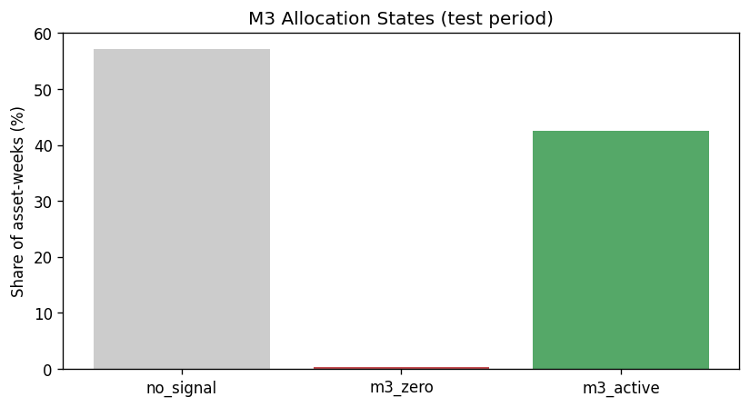

# M3 Bet-Sizing & Allocation Analysis

**Research use only — not investment advice.**

## M1 / M2 / M3 roles (Joubert framework)

| Layer | Output | Question answered |
| --- | --- | --- |
| **M1** | `M1_signal` ∈ {-1, 0, 1} | Which side? (buy candidate or not) |
| **M2** | `p_success` ∈ [0, 1] | How likely is the M1 trade profitable? |
| **M3** | `M3_size` ∈ [0, 1] | How much capital to bet? (before portfolio caps) |

M3 is a **deterministic sizing rule**, not a classifier. Binary thresholding at T=0.55 is an all-or-nothing M3 rule, not a separate M2 model.

## Allocation states (long-only interpretation)

| State | Condition | Meaning |
| --- | --- | --- |
| `no_signal` | M1 = 0 | No buy candidate from M1 (not selected in top-K) |
| `m3_zero` | M1 ≠ 0 and M3_size = 0 | Buy candidate existed; M3 allocated zero capital |
| `m3_active` | M1 ≠ 0 and M3_size > 0 | Buy candidate received positive bet fraction |

## Allocation summary by period

| period | allocation_state | count | share |
| --- | --- | --- | --- |
| full | no_signal | 3156 | 57.1429% |
| full | m3_zero | 7 | 0.1267% |
| full | m3_active | 2360 | 42.7304% |
| train | no_signal | 2000 | 57.1429% |
| train | m3_zero | 0 | 0.0000% |
| train | m3_active | 1500 | 42.8571% |
| test | no_signal | 1156 | 57.1429% |
| test | m3_zero | 7 | 0.3460% |
| test | m3_active | 860 | 42.5111% |

## M3 rejection analysis (test, M1 candidates only)

| allocation_state | n | mean_p_success | median_p_success | mean_trade_return | hit_rate |
| --- | --- | --- | --- | --- | --- |
| m3_zero | 7 | 0.4968 | 0.4965 | 0.7722% | 57.1429% |
| m3_active | 860 | 0.5764 | 0.5778 | 0.8866% | 60.8140% |

## M3 rule comparison (binary vs linear vs ECDF)

| m3_mode | m1_candidates | m3_zero_count | m3_active_count | m3_zero_share | mean_m3_size_on_candidates |
| --- | --- | --- | --- | --- | --- |
| binary | 2367 | 173 | 2194 | 7.3088% | 0.9269 |
| linear | 2367 | 7 | 2360 | 0.2957% | 0.1757 |
| ecdf | 2367 | 51 | 2316 | 2.1546% | 0.4286 |
