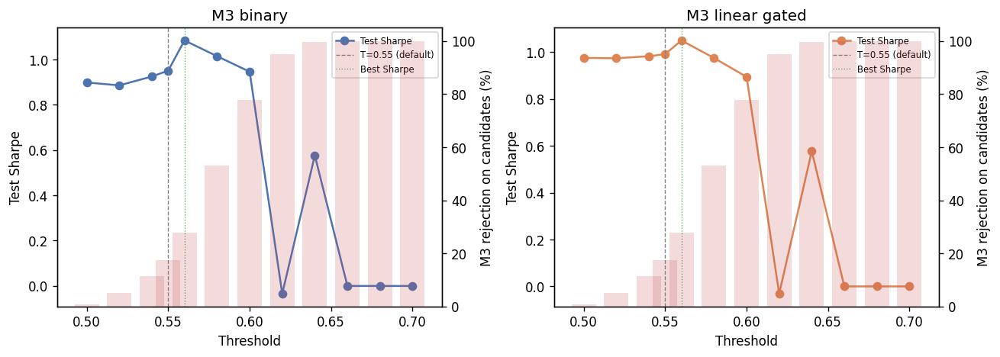

# M3 Threshold Sweep Analysis

**Research use only — not investment advice.**

At the default threshold **T=0.55**, binary M3 approves ~**100%** of M1 candidates (recall ≈ 1) because calibrated `p_success` on the test set rarely falls below 0.55. This sweep finds thresholds where M3 **meaningfully rejects** candidates (`m3_zero` ≥ 5% of M1 signals) and compares test-period portfolio Sharpe vs M1-only.

## Setup

- **Test window:** `2021-01-01` to `latest`
- **Default threshold:** `0.55` (`models.m3.threshold` / `models.m2.threshold`)
- **Binary M3:** size = 1 if `p_success ≥ T`, else 0
- **Linear gated M3:** size = `max(0, 2p−1)` if `p_success ≥ T`, else 0 (research variant; production linear is ungated)
- **Meaningful rejection:** ≥5% of M1 candidates with `m3_zero`; binary also requires recall < 99%

## Recommended thresholds

### Binary M3

- **Recommended T:** `0.56`
- **Test Sharpe:** 1.0842 (vs baseline T=0.55: 0.9508)
- **Sharpe edge vs M1-only:** 0.2088
- **M3 rejection share (test candidates):** 27.7970%
- **M2 recall / precision:** 0.7362 / 0.6198
- **Apply to config?** `yes`
- **Rationale:** Best test Sharpe among thresholds with meaningful rejection (≥5% m3_zero, recall < 99% for binary): T=0.56, Sharpe 1.0842, rejection 27.8%, recall 0.736.

### Linear gated M3

- **Recommended T:** `0.56`
- **Test Sharpe:** 1.0496 (vs baseline T=0.55: 0.9912)
- **Sharpe edge vs M1-only:** 0.1742
- **M3 rejection share (test candidates):** 27.7970%
- **M2 recall / precision:** 0.7362 / 0.6198
- **Apply to config?** `yes`
- **Rationale:** Best test Sharpe among thresholds with meaningful rejection (≥5% m3_zero, recall < 99% for binary): T=0.56, Sharpe 1.0496, rejection 27.8%, recall 0.736.

## Full comparison table (test period)

| m3_mode | threshold | m1_candidates | m3_zero_count | m3_rejection_share | m3_approval_rate | mean_m3_size_on_candidates | m2_recall | m2_precision | m2_f1 | degeneracy_note | test_ann_return | test_sharpe | test_max_drawdown | sharpe_edge_vs_m1 | meaningful_rejection |
| --- | --- | --- | --- | --- | --- | --- | --- | --- | --- | --- | --- | --- | --- | --- | --- |
| binary | 0.5000 | 867 | 7 | 0.8074% | 99.1926% | 0.9919 | 0.9924 | 0.6081 | 0.7541 |  | 9.1240% | 0.8985 | -19.6282% | 0.0231 | no |
| binary | 0.5200 | 867 | 45 | 5.1903% | 94.8097% | 0.9481 | 0.9469 | 0.6071 | 0.7398 |  | 8.7829% | 0.8858 | -17.8036% | 0.0103 | yes |
| binary | 0.5400 | 867 | 100 | 11.5340% | 88.4660% | 0.8847 | 0.8994 | 0.6180 | 0.7326 |  | 8.8595% | 0.9252 | -17.4281% | 0.0498 | yes |
| binary | 0.5500 | 867 | 151 | 17.4164% | 82.5836% | 0.8258 | 0.8444 | 0.6215 | 0.7160 |  | 8.6732% | 0.9508 | -14.4468% | 0.0754 | yes |
| binary | 0.5600 | 867 | 241 | 27.7970% | 72.2030% | 0.7220 | 0.7362 | 0.6198 | 0.6730 |  | 9.4717% | 1.0842 | -10.1248% | 0.2088 | yes |
| binary | 0.5800 | 867 | 461 | 53.1719% | 46.8281% | 0.4683 | 0.5085 | 0.6601 | 0.5745 |  | 7.4607% | 1.0145 | -10.3767% | 0.1391 | yes |
| binary | 0.6000 | 867 | 675 | 77.8547% | 22.1453% | 0.2215 | 0.2334 | 0.6406 | 0.3421 |  | 4.8243% | 0.9461 | -7.1630% | 0.0707 | yes |
| binary | 0.6200 | 867 | 824 | 95.0404% | 4.9596% | 0.0496 | 0.0380 | 0.4651 | 0.0702 |  | -0.0717% | -0.0344 | -5.6143% | -0.9098 | yes |
| binary | 0.6400 | 867 | 865 | 99.7693% | 0.2307% | 0.0023 | 0.0019 | 0.5000 | 0.0038 |  | 0.0958% | 0.5767 | -0.0143% | -0.2987 | yes |
| binary | 0.6600 | 867 | 867 | 100.0000% | 0.0000% | 0.0000 | 0.0000 | 0.0000 | 0.0000 |  | 0.0000% | 0.0000 | 0.0000% | -0.8754 | yes |
| binary | 0.6800 | 867 | 867 | 100.0000% | 0.0000% | 0.0000 | 0.0000 | 0.0000 | 0.0000 |  | 0.0000% | 0.0000 | 0.0000% | -0.8754 | yes |
| binary | 0.7000 | 867 | 867 | 100.0000% | 0.0000% | 0.0000 | 0.0000 | 0.0000 | 0.0000 |  | 0.0000% | 0.0000 | 0.0000% | -0.8754 | yes |
| linear_gated | 0.5000 | 867 | 7 | 0.8074% | 99.1926% | 0.1515 | 0.9924 | 0.6081 | 0.7541 |  | 1.7718% | 0.9749 | -2.3934% | 0.0995 | no |
| linear_gated | 0.5200 | 867 | 45 | 5.1903% | 94.8097% | 0.1507 | 0.9469 | 0.6071 | 0.7398 |  | 1.7688% | 0.9736 | -2.4096% | 0.0982 | yes |
| linear_gated | 0.5400 | 867 | 100 | 11.5340% | 88.4660% | 0.1468 | 0.8994 | 0.6180 | 0.7326 |  | 1.7746% | 0.9820 | -2.4264% | 0.1066 | yes |
| linear_gated | 0.5500 | 867 | 151 | 17.4164% | 82.5836% | 0.1413 | 0.8444 | 0.6215 | 0.7160 |  | 1.7672% | 0.9912 | -2.3487% | 0.1158 | yes |
| linear_gated | 0.5600 | 867 | 241 | 27.7970% | 72.2030% | 0.1299 | 0.7362 | 0.6198 | 0.6730 |  | 1.8430% | 1.0496 | -2.3487% | 0.1742 | yes |
| linear_gated | 0.5800 | 867 | 461 | 53.1719% | 46.8281% | 0.0943 | 0.5085 | 0.6601 | 0.5745 |  | 1.5597% | 0.9747 | -2.3487% | 0.0993 | yes |
| linear_gated | 0.6000 | 867 | 675 | 77.8547% | 22.1453% | 0.0497 | 0.2334 | 0.6406 | 0.3421 |  | 1.0292% | 0.8939 | -1.7277% | 0.0185 | yes |
| linear_gated | 0.6200 | 867 | 824 | 95.0404% | 4.9596% | 0.0127 | 0.0380 | 0.4651 | 0.0702 |  | -0.0165% | -0.0313 | -1.4734% | -0.9067 | yes |
| linear_gated | 0.6400 | 867 | 865 | 99.7693% | 0.2307% | 0.0007 | 0.0019 | 0.5000 | 0.0038 |  | 0.0280% | 0.5774 | -0.0042% | -0.2980 | yes |
| linear_gated | 0.6600 | 867 | 867 | 100.0000% | 0.0000% | 0.0000 | 0.0000 | 0.0000 | 0.0000 |  | 0.0000% | 0.0000 | 0.0000% | -0.8754 | yes |
| linear_gated | 0.6800 | 867 | 867 | 100.0000% | 0.0000% | 0.0000 | 0.0000 | 0.0000 | 0.0000 |  | 0.0000% | 0.0000 | 0.0000% | -0.8754 | yes |
| linear_gated | 0.7000 | 867 | 867 | 100.0000% | 0.0000% | 0.0000 | 0.0000 | 0.0000 | 0.0000 |  | 0.0000% | 0.0000 | 0.0000% | -0.8754 | yes |

## Key findings

- **Binary best with rejection:** T=0.56 (Sharpe 1.0842, rejection 27.7970%).
- **ECDF sizing** (not swept here) remains the primary risk-shaping layer; threshold sweeps target interpretable binary/linear rules.

Related: [m3_allocation_analysis.md](m3_allocation_analysis.md) · [m2_diagnostics.md](m2_diagnostics.md)
