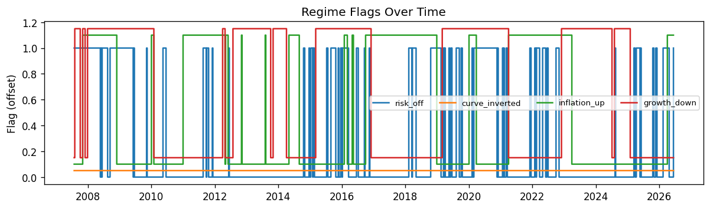
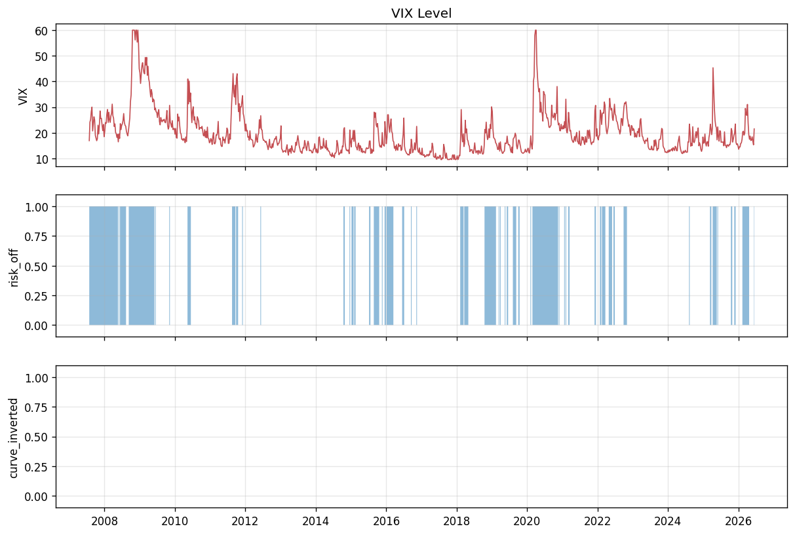
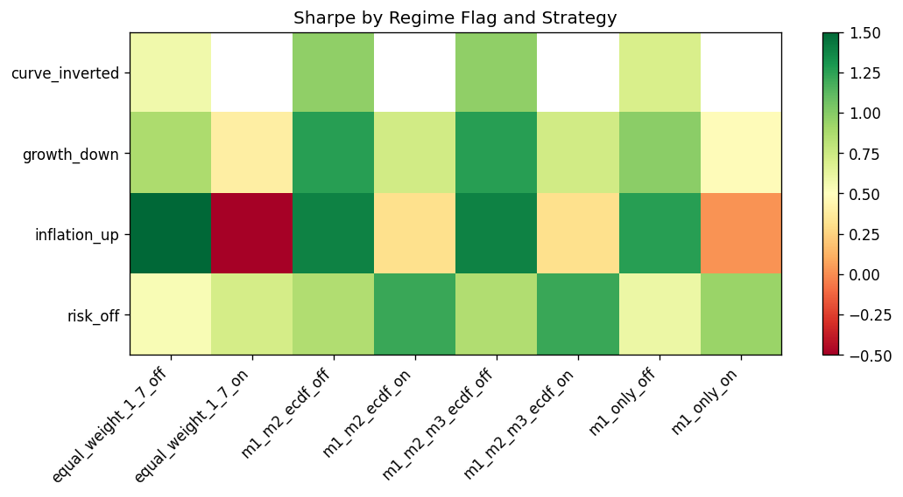

# Market & Regime Analysis

**Research use only — not investment advice.**

## vs `main`

| Item | `main` | `vitaly_week5` |
| --- | --- | --- |
| Regime module | None | `src/regime_analysis.py` |
| Performance by flag | Not reported | ECDF Sharpe **1.21** (`risk_off=on`) vs **0.86** (`risk_off=off`) |
| M1 IC by regime (test) | Not reported | Strongest: inflation-off IC **0.153** |
| M2 AUC by regime (test) | Not reported | Best: `risk_off=on` AUC **0.620** |

Branch update: [Executive summary](../BRANCH_UPDATE_REPORT.md) · [Technical report](branch_update_vitaly_week5.md)

## Regime Feature Definitions

| Flag / Series | Definition |
| --- | --- |
| `risk_off` | VIX above its 75th percentile (156-week rolling) |
| `curve_inverted` | 10Y–2Y Treasury spread < 0 |
| `inflation_up` | CPI YoY above its 156-week median |
| `growth_down` | Industrial production YoY below its 156-week median |
| `vix_level`, `credit_stress`, `yield_curve` | Continuous macro/risk levels (lagged) |

## Regime Transitions

| regime_flag | n_transitions | pct_on | avg_spell_on_weeks | avg_spell_off_weeks |
| --- | --- | --- | --- | --- |
| risk_off | 102 | 0.28 | 5.27 | 13.96 |
| curve_inverted | 0 | 0.0 | nan | 986.0 |
| inflation_up | 25 | 0.41 | 31.0 | 44.85 |
| growth_down | 20 | 0.53 | 51.9 | 42.45 |

## Strategy Performance by Regime

| regime_flag | regime_state | strategy | n_weeks | annualized_return | sharpe | hit_rate |
| --- | --- | --- | --- | --- | --- | --- |
| risk_off | on | equal_weight_1_7 | 274 | 13.5859% | 0.7131 | 59.1241% |
| risk_off | on | m1_only | 274 | 11.5749% | 0.9341 | 62.4088% |
| risk_off | on | m1_m2_m3_ecdf | 274 | 9.8821% | 1.2121 | 63.5036% |
| risk_off | on | m1_m2_ecdf | 274 | 9.8821% | 1.2121 | 63.5036% |
| risk_off | off | equal_weight_1_7 | 712 | 5.0594% | 0.5313 | 54.7753% |
| risk_off | off | m1_only | 712 | 5.7260% | 0.5987 | 57.4438% |
| risk_off | off | m1_m2_m3_ecdf | 712 | 5.2759% | 0.8564 | 58.1461% |
| risk_off | off | m1_m2_ecdf | 712 | 5.2759% | 0.8564 | 58.1461% |
| curve_inverted | off | equal_weight_1_7 | 986 | 7.3625% | 0.5708 | 55.9838% |
| curve_inverted | off | m1_only | 986 | 7.3198% | 0.7021 | 58.8235% |
| curve_inverted | off | m1_m2_m3_ecdf | 986 | 6.5362% | 0.9649 | 59.6349% |
| curve_inverted | off | m1_m2_ecdf | 986 | 6.5362% | 0.9649 | 59.6349% |
| inflation_up | on | equal_weight_1_7 | 403 | -6.8536% | -0.4854 | 51.8610% |
| inflation_up | on | m1_only | 403 | 0.1800% | 0.0163 | 56.3275% |
| inflation_up | on | m1_m2_m3_ecdf | 403 | 1.9318% | 0.3090 | 58.0645% |
| inflation_up | on | m1_m2_ecdf | 403 | 1.9318% | 0.3090 | 58.0645% |
| inflation_up | off | equal_weight_1_7 | 583 | 18.4386% | 1.5615 | 58.8336% |
| inflation_up | off | m1_only | 583 | 12.5506% | 1.2628 | 60.5489% |
| inflation_up | off | m1_m2_m3_ecdf | 583 | 9.8400% | 1.3884 | 60.7204% |
| inflation_up | off | m1_m2_ecdf | 583 | 9.8400% | 1.3884 | 60.7204% |
| growth_down | on | equal_weight_1_7 | 519 | 5.8179% | 0.3946 | 54.3353% |
| growth_down | on | m1_only | 519 | 5.1731% | 0.4768 | 57.0328% |
| growth_down | on | m1_m2_m3_ecdf | 519 | 5.2345% | 0.7334 | 57.6108% |
| growth_down | on | m1_m2_ecdf | 519 | 5.2345% | 0.7334 | 57.6108% |
| growth_down | off | equal_weight_1_7 | 467 | 9.1055% | 0.8684 | 57.8158% |
| growth_down | off | m1_only | 467 | 9.7571% | 0.9818 | 60.8137% |
| growth_down | off | m1_m2_m3_ecdf | 467 | 8.0016% | 1.2603 | 61.8844% |
| growth_down | off | m1_m2_ecdf | 467 | 8.0016% | 1.2603 | 61.8844% |

## M1 IC by Regime (Test)

| regime_flag | regime_state | ic_mean | n_weeks |
| --- | --- | --- | --- |
| risk_off | on | -0.0255 | 50 |
| risk_off | off | 0.1339 | 235 |
| curve_inverted | off | 0.1061 | 285 |
| inflation_up | on | 0.0344 | 115 |
| inflation_up | off | 0.1529 | 170 |
| growth_down | on | 0.1516 | 122 |
| growth_down | off | 0.0712 | 163 |

## M2 AUC by Regime (Test)

| regime_flag | regime_state | auc | n_trades | base_rate |
| --- | --- | --- | --- | --- |
| risk_off | on | 0.6195 | 150 | 0.5133 |
| risk_off | off | 0.584 | 705 | 0.6057 |
| curve_inverted | off | 0.5884 | 855 | 0.5895 |
| inflation_up | on | 0.5148 | 345 | 0.4812 |
| inflation_up | off | 0.5627 | 510 | 0.6627 |
| growth_down | on | 0.5645 | 366 | 0.6311 |
| growth_down | off | 0.6051 | 489 | 0.5583 |

## Train vs Test Macro Context

| period | feature | mean | std | min | max | pct_on |
| --- | --- | --- | --- | --- | --- | --- |
| train | vix_level | 19.9732 | 9.3855 | 9.59 | 59.93 | nan |
| train | credit_stress | 19.9452 | 9.3893 | 9.59 | 59.93 | nan |
| train | yield_curve | 0.1995 | 0.0939 | 0.0959 | 0.5993 | nan |
| train | growth_trend | -0.0024 | 0.0505 | -0.1605 | 0.0794 | nan |
| train | inflation_trend | 0.0178 | 0.0127 | -0.0148 | 0.0531 | nan |
| train | risk_off | 0.3195 | 0.4666 | 0.0 | 1.0 | 0.3195 |
| train | curve_inverted | 0.0 | 0.0 | 0.0 | 0.0 | 0.0 |
| train | inflation_up | 0.4108 | 0.4923 | 0.0 | 1.0 | 0.4108 |
| train | growth_down | 0.5663 | 0.4959 | 0.0 | 1.0 | 0.5663 |
| test | vix_level | 19.2167 | 5.2536 | 11.93 | 45.31 | nan |
| test | credit_stress | 19.2593 | 5.2528 | 11.93 | 45.31 | nan |
| test | yield_curve | 0.1926 | 0.0525 | 0.1193 | 0.4531 | nan |
| test | growth_trend | 0.01 | 0.0236 | -0.0568 | 0.0794 | nan |
| test | inflation_trend | 0.0376 | 0.0124 | 0.0132 | 0.0531 | nan |
| test | risk_off | 0.1754 | 0.381 | 0.0 | 1.0 | 0.1754 |
| test | curve_inverted | 0.0 | 0.0 | 0.0 | 0.0 | 0.0 |
| test | inflation_up | 0.4035 | 0.4915 | 0.0 | 1.0 | 0.4035 |
| test | growth_down | 0.4281 | 0.4957 | 0.0 | 1.0 | 0.4281 |
