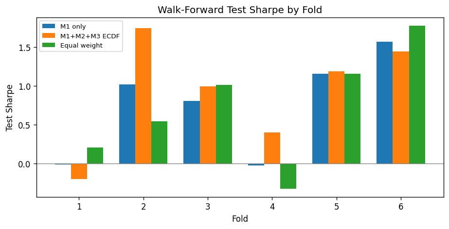
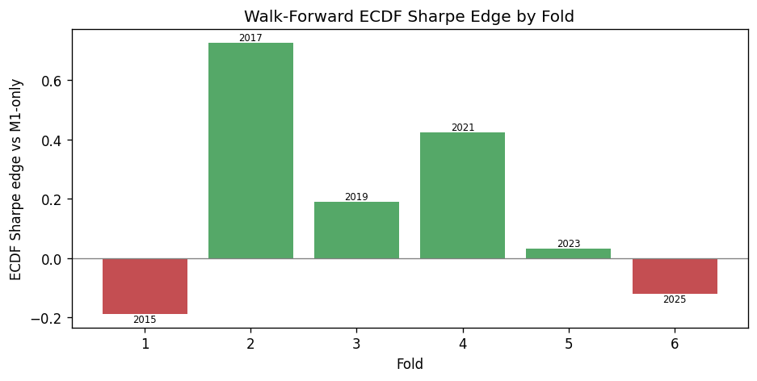

# Walk-Forward Analysis: ECDF Edge Stability

**Research use only — not investment advice.**

This report answers whether **M1+M2+M3 ECDF** improves risk-adjusted returns vs **M1-only** across **multiple out-of-sample windows**, not only the production test period (2021+).

## Method

- **Design:** expanding train window; first train end `2014-12-31`; **2-year** test blocks
- **Production window (config):** `2021-01-01` onward — compared but not the sole metric
- **Per fold:** refit M1, M2, M3; backtest long-only; score test-block Sharpe
- **Edge:** `ECDF Sharpe − M1-only Sharpe` on each fold's test window

## Executive verdict

**ECDF edge is positive in 4/6 folds with mean +0.177 — stable under a majority-fold criterion.**

| Metric | Value |
| --- | --- |
| Folds completed | 6 |
| Stable (majority + positive mean edge)? | **Yes** |
| Mean ECDF Sharpe edge vs M1 | 0.1774 |
| Median edge | 0.1111 |
| Folds with positive edge | 4 / 6 (67%) |
| Mean ECDF / M1 / EW Sharpe | 0.9289 / 0.7515 / 0.7278 |
| ECDF beats equal-weight (folds) | 3 / 6 |
| Mean M2 AUC (test, across folds) | 0.5482 |

## Pre-2021 vs production window

| Segment | Folds | Mean ECDF edge vs M1 | Positive folds |
| --- | ---: | ---: | ---: |
| Pre-`2021-01-01` test blocks | 3 | 0.2431 | 2 |
| `2021-01-01`+ test blocks | 3 | 0.1117 | 2 |

## Key questions

### 1. Is ECDF Sharpe edge vs M1 stable across folds?

**Yes (under majority criterion):** mean edge 0.1774, positive in 4/6 folds.

### 2. Is the 2021+ production result representative?

**Broadly yes, not 2021-specific.** Both eras show positive mean ECDF edge; pre-2021 mean edge (0.243) is actually **higher** than production-era folds (0.112), so the single 2021+ headline is not an isolated outlier.

### 3. Does ECDF add value beyond equal-weight?

ECDF Sharpe exceeds equal-weight in **3** of **6** folds (mean ECDF Sharpe 0.9289 vs EW 0.7278).

### 4. What is M2 doing across folds?

Mean test AUC **0.5482** — ranking remains modest; ECDF edge is driven by **vol/drawdown shaping** from `p_success`, not binary filtering.

## Fold-level results

| fold_id | train_start | train_end | test_start | test_end | test_weeks | m1_only_sharpe | m1_only_ann_return | ecdf_sharpe | ecdf_ann_return | ecdf_sharpe_edge_vs_m1 | ecdf_return_edge_vs_m1 | equal_weight_sharpe | m2_auc | m2_auc_pr | m2_n_trades |
| --- | --- | --- | --- | --- | --- | --- | --- | --- | --- | --- | --- | --- | --- | --- | --- |
| 1 | 2006-01-01 | 2014-12-31 | 2015-01-01 | 2016-12-31 | 105 | -0.0094 | -0.0892% | -0.1971 | -1.3781% | -0.1876 | -1.2889% | 0.2059 | 0.4706 | 0.4598707984024878 | 315 |
| 2 | 2006-01-01 | 2016-12-31 | 2017-01-01 | 2018-12-31 | 104 | 1.0157 | 8.5207% | 1.7423 | 7.0038% | 0.7267 | -1.5169% | 0.5454 | 0.6306 | 0.6574411889849903 | 312 |
| 3 | 2006-01-01 | 2018-12-31 | 2019-01-01 | 2020-12-31 | 104 | 0.8053 | 9.5127% | 0.9956 | 6.8752% | 0.1903 | -2.6375% | 1.0119 | 0.5679 | 0.6523833876271765 | 312 |
| 4 | 2006-01-01 | 2020-12-31 | 2021-01-01 | 2022-12-31 | 105 | -0.0224 | -0.2515% | 0.4018 | 2.7850% | 0.4242 | 3.0365% | -0.3229 | 0.5061 | 0.585656004393908 | 315 |
| 5 | 2006-01-01 | 2022-12-31 | 2023-01-01 | 2024-12-31 | 104 | 1.1563 | 10.2687% | 1.1882 | 7.0894% | 0.0319 | -3.1794% | 1.1535 | 0.6129 | 0.7016711786363587 | 312 |
| 6 | 2006-01-01 | 2024-12-31 | 2025-01-01 | 2026-06-12 | 76 | 1.5634 | 18.8077% | 1.4424 | 12.7416% | -0.1209 | -6.0661% | 1.7730 | 0.5011 | 0.6572920928238803 | 228 |

## Transaction-cost sensitivity (production window)

| transaction_cost_bps | strategy | annualized_return | sharpe | max_drawdown | hit_rate | n_weeks | ecdf_sharpe_edge_vs_m1 |
| --- | --- | --- | --- | --- | --- | --- | --- |
| 0.0 | equal_weight_1_7 | 0.0734 | 0.6853 | -0.2390 | 0.5439 | 285 | — |
| 0.0 | m1_only | 0.0869 | 0.8139 | -0.2078 | 0.5965 | 285 | — |
| 0.0 | m1_m2_m3_ecdf | 0.0746 | 1.0242 | -0.1100 | 0.5930 | 285 | 0.2103 |
| 5.0 | equal_weight_1_7 | 0.0734 | 0.6853 | -0.2390 | 0.5439 | 285 | — |
| 5.0 | m1_only | 0.0840 | 0.7869 | -0.2100 | 0.5965 | 285 | — |
| 5.0 | m1_m2_m3_ecdf | 0.0702 | 0.9641 | -0.1133 | 0.5930 | 285 | 0.1772 |
| 10.0 | equal_weight_1_7 | 0.0734 | 0.6853 | -0.2390 | 0.5439 | 285 | — |
| 10.0 | m1_only | 0.0812 | 0.7600 | -0.2130 | 0.5895 | 285 | — |
| 10.0 | m1_m2_m3_ecdf | 0.0658 | 0.9042 | -0.1166 | 0.5895 | 285 | 0.1442 |
| 25.0 | equal_weight_1_7 | 0.0734 | 0.6853 | -0.2390 | 0.5439 | 285 | — |
| 25.0 | m1_only | 0.0726 | 0.6794 | -0.2222 | 0.5825 | 285 | — |
| 25.0 | m1_m2_m3_ecdf | 0.0528 | 0.7255 | -0.1281 | 0.5754 | 285 | 0.0462 |

## Implications

- Report **fold-level** ECDF edge alongside the single 2021+ test table in `final_report.md`.
- If edge is fold-dependent, prefer **regime-conditioned M3** or accept ECDF as a drawdown tool, not return engine.
- M1-only remains the return-oriented sleeve when ECDF edge is negative on a fold.

Related: [evaluation_analysis.md](evaluation_analysis.md) · [final_report.md](final_report.md)
